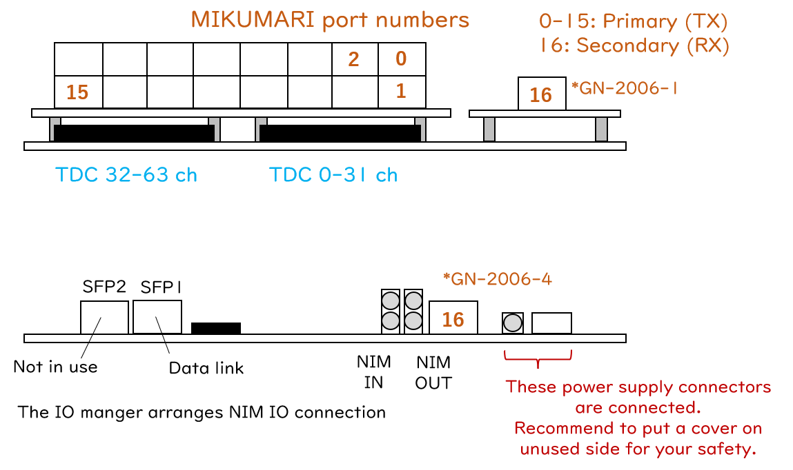

# Mikumari Clock Hub

## Overview

Mikumari Clock Hub (MikuClockHub)は上流から時刻同期を受け、更に16台の下流モジュールを同期する事が出来る、クロック分配ネットワーク上のリレーモジュールです。
スタンドアロンモードを有しており、上流から自身を切り離して新しいROOTモジュールとして動作することが出来ます。
単にClockHubと表記する事もあります。
ファームウェア内部に64chの1ns精度連続読み出しTDCも有しています。


[Github repository](https://github.com/AMANEQ-official/MikuClockPrim)

```
- Unique ID:                  0xF100

- Number of clock port:       16

- Number of inputs:           65
- Timing measurements:        Both edges
- TDC precision:              1ns
- Double hit resolution:      ~8ns
- Max TOT length:             4000ns

- Link protocol:              SiTCP
- Default IP:                 192.168.10.16
- Data link speed:            1Gbps

- Data word width:            64bit
- Acceptable max input rate:  ~28MHz/board
- System clock freq.:         125MHz
```

### History

|Version|Date|Changes|
|:----:|:----|:----|
|v2.5|2024.6.9|事実上の初期版|

# Functions

{: #BL-DIAGRAM width="80%"}

[図](#BL-DIAGRAM)はMikumari-ClockHubの簡易ブロックダイアグラムです。
CRVもしくは前面MIKUMARIポートでクロック信号を受信し、CDD-OPTメザニンカードを用いて最大16台のリーフモジュールを時刻同期する事が出来ます。
加えて、65ch文のStr-LRTDCを内蔵しており、main inputとNIM-INからからの信号を測定する事が出来ます。
入力信号はStr-LRTDCと同様にスケーラーブロックにも接続されています。
Str-LRTDCの機能とスケーラー機能についてはStr-LRTDCのページを参照してください。

スタンドアロンモードを有効にするとクロック受信ポートが無効になり、システムクロックをローカル発振器から生成するようになります。
検出器サブブロックをメインDAQシステムから切り離して独自に試験を行いたい時に活用してください。
この場合は本回路のハートビートユニットが定義するハートビートカウンターとフレーム番号が新しい基準になり、各リーフモジュール内のLACCP fine offsetは本回路のハートビートパルスに対する時間差を示します。
また、ハートビートフレーム状態を切り替える事も可能になります。

本回路上のシステムクロック信号はCDCE62002によって生成されるので、**CDCE62002を未設定のAMANEQではこのファームウェアは動作しません。**
125 MHzの入力から500 MHzと125 MHzのクロック信号を生成するようにCDCE62002を設定してください。

{: #PORT-MAP width="80%"}

[図](#PORT-MAP)はTDC入力チャンネル番号とMIKUMARIのポート番号を示しています。
16番が受信用のMIKUMARIポートで、0番から15番までがクロック信号の送信側です。

### LED and DIP switch

1-3番が点灯していればモジュールとして正常に動作しています。

|LED #||Comment|
|:----:|:----|:----|
|1| PLL locked| 全ての内部クロック信号が正常に出力されている状態です。 |
|2| MIKUMARI (16) link up| MIKUMARIポートの16番がリンクアップしている状態です。 |
|3| Ready for DAQ| 時刻同期が完了し、DAQを走らせられる状態である事を示します。 |
|4| DAQ is running| データ読み出し中である事を示します。 |

|DIP #||Comment|
|:----:|:----|:----|
|1| SiTCP IP setting | 0: デフォルトIPを使用します <br> 1: ユーザー設定のIPを使用します (要ライセンス)。|
|2| NIMOUT setting | 0: NIMOUT-1からハートビート信号が出力されます<br>1: NIMOUT-1からLACCPがトリガー信号が出力されます|
|3| Not in use | |
|4| Not in use | |

## Local bus modules

Str-LRTDCには6個のローカルバスモジュールが存在します。
以下がローカルバスアドレスのマップです。

|Local Module|Address range|
|:----|:----|
|Mikumari Utility        |0x0000'0000 - 0x0FFF'0000|
|Streaming TDC           |0x1000'0000 - 0x1FFF'0000|
|Scaler                  |0x8000'0000 - 0x8FFF'0000|
|CDCE62002 Controller    |0xB000'0000 - 0xBFFF'0000|
|Self Diagnosis System   |0xC000'0000 - 0xCFFF'0000|
|Flash Memory Programmer |0xD000'0000 - 0xDFFF'0000|
|Bus Controller          |0xE000'0000 - 0xEFFF'0000|

## Streaming-TDC block

入力チャンネル数が異なること以外はStr-LRTDCと同様のため、Str-LRTDCの説明を参照してください。
レジスタアドレスも全く同じです。

## Scaler

Str-LRTDCと同様のため、Str-LRTDCの説明を参照してください。
レジスタアドレスも全く同じです。