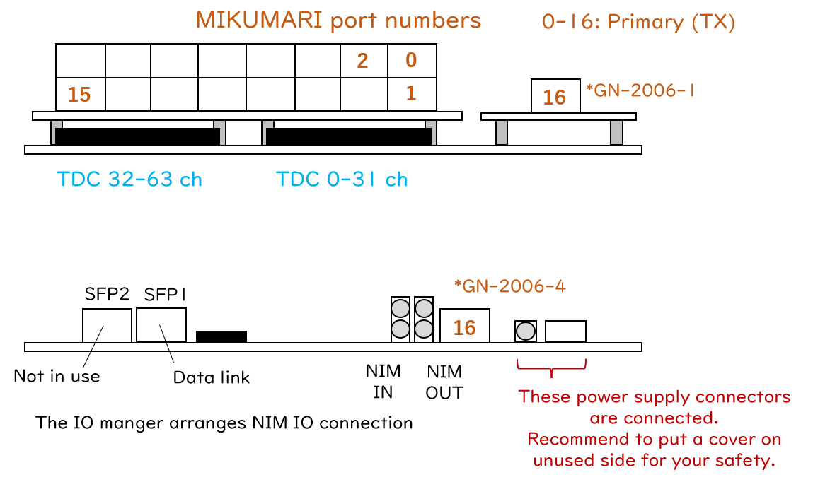

# Mikumari Clock Root

## Overview

Mikumari Clock Root (MikuClockRoot)は17台の下流モジュールを同期する事が出来る、クロック分配ネットワーク上のROOTモジュールです。
単にClockRootと表記する事もあります。
歴史的な事情からリポジトリ名がMikumariClockPrimとなっていますが、MIKUMARI link protocolのプライマリ側と紛らわしいためROOTと表現する事になりました。
論文でも同様にroot-moduleの表記を取っています。
ファームウェア内部に64chの1ns精度連続読み出しTDCも有しています。

このファームウェアの開発はversion 2.7をもってターミネートします。
クロック分配ネットワークの頂点にはroot-modeで起動したMikumari Clock Hubモジュールを配置してください。

[Github repository](https://github.com/AMANEQ-official/MikuClockPrim)

```
- Unique ID:                  0xF000

- Number of clock port:       17

- Number of inputs:           64
- Timing measurements:        Both edges
- TDC precision:              1ns
- Double hit resolution:      ~8ns
- Max TOT length:             4000ns

- Link protocol:              SiTCP
- Default IP:                 192.168.10.16
- Data link speed:            1Gbps

- Data word width:            64bit
- Acceptable max input rate:  ~28MHz/board
- System clock freq.:         125MHz
```

### History

|Version|Date|Changes|
|:----:|:----|:----|
|v2.7|2025.3.5| - Bugfix version of v2.6. <br> - Enabling the function to generate data words with input throttling type-2 start/end data types. |
|v2.6|2025.1.6| - Updating LACCP (v2.1) supporting the frame flag distribution. <br> - Introducing gated scaler. <br> - Introducing IO manager block arranging input/output paths to the NIM IO.|
|v2.5|2024.6.9|事実上の初期版|

## Functions

{: #BL-DIAGRAM width="80%"}

[図](#BL-DIAGRAM)はMikumari-ClockRootの簡易ブロックダイアグラムです。
CDD-OPTメザニンカードの16ポートに加えてCRV/前面MIKUMARIポートも活用して、最大17台のリーフモジュールを時刻同期する事が出来ます。
加えて、64ch文のStr-LRTDCを内蔵しており、main inputからの信号を測定する事が出来ます。
入力信号はStr-LRTDCと同様にスケーラーブロックにも接続されています。
Str-LRTDCの機能とスケーラー機能についてはStr-LRTDCのページを参照してください。

時刻ドメインを定義するモジュールであるため、外部クロックによって更に同期を受ける機能は有していません。
本回路のハートビートユニットが定義するハートビートカウンターとフレーム番号が基準であり、各リーフモジュール内のLACCP fine offsetは本回路のハートビートパルスに対する時間差を示します。
また、ハートビートフレーム状態を切り替えられる唯一の回路です。

本回路上のシステムクロック信号はCDCE62002によって生成されるので、**CDCE62002を未設定のAMANEQではこのファームウェアは動作しません。**
125 MHzの入力から500 MHzと125 MHzのクロック信号を生成するようにCDCE62002を設定してください。

{: #PORT-MAP width="80%"}

[図](#PORT-MAP)はTDC入力チャンネル番号とMIKUMARIのポート番号を示しています。
0番から16番まで全てクロック信号の送信側です。

### LED and DIP switch

1番が点灯していればモジュールとして正常に動作しています。

|LED #||Comment|
|:----:|:----|:----|
|1| DAQ is running| データ読み出し中である事を示します。 |
|2| Frame status| ハートビートフレーム状態を示します。 |
|3| Not in use| |
|4| PLL locked| 全ての内部クロック信号が正常に出力されている状態です。 |

|DIP #||Comment|
|:----:|:----|:----|
|1| SiTCP IP setting | 0: デフォルトIPを使用します <br> 1: ユーザー設定のIPを使用します (要ライセンス)。|
|2| Not in use | |
|3| Not in use | |
|4| Not in use | |

## Local bus modules

Str-LRTDCには7個のローカルバスモジュールが存在します。
以下がローカルバスアドレスのマップです。

|Local Module|Address range|
|:----|:----|
|Mikumari Utility        |0x0000'0000 - 0x0FFF'0000|
|Streaming TDC           |0x1000'0000 - 0x1FFF'0000|
|IO Manager              |0x2000'0000 - 0x2FFF'0000|
|Scaler                  |0x8000'0000 - 0x8FFF'0000|
|CDCE62002 Controller    |0xB000'0000 - 0xBFFF'0000|
|Self Diagnosis System   |0xC000'0000 - 0xCFFF'0000|
|Flash Memory Programmer |0xD000'0000 - 0xDFFF'0000|
|Bus Controller          |0xE000'0000 - 0xEFFF'0000|

## Streaming-TDC block

入力チャンネル数が異なること以外はStr-LRTDCと同様のため、Str-LRTDCの説明を参照してください。
レジスタアドレスも全く同じです。

## Scaler

Str-LRTDCと同様のため、Str-LRTDCの説明を参照してください。
レジスタアドレスも全く同じです。

## IO Manager

IO ManagerはAMANEQのNIM IOとFPGA内部の信号等の接続関係を管理するモジュールです。
NIMポートから入力された信号をどの内部信号へ接続するか、また内部信号をどのNIMポートから出力するかをSiTCPを通じて変更します。

|Register name|Address|Read/Write|Bit width|Comment|
|:----|:----|:----:|:----:|:----|
|kFrameFlag1In  | 0x20000000|  W/R|2| Setting the NIM-IN port to the internal frame flag-1 signal. (default 0x0)|
|kFrameFlag2In  | 0x20100000|  W/R|2| Setting the NIM-IN port to the internal frame flag-2 signal. (default (0x1))|
|kTriggerIn     | 0x20200000|  W/R|2| Setting the NIM-IN port to the internal trigger in signal. (default (0x3))|
|kScrResetIn    | 0x20300000|  W/R|2| Setting the NIM-IN port to the internal scaler reset signal. This signal will be distributed to other modules through MIKUMARI. (default (0x3))|
| |  |  | | |
|kSelOutSig1    | 0x21000000|  W/R|3| Selecting the internal signal to output from the NIM-OUT port 1. |
|kSelOutSig2    | 0x22000000|  W/R|3| Selecting the internal signal to output from the NIM-OUT port 2. |

アドレス値が`0x20X0'0000`のレジスタはNIM-INポートをどの内部信号へ接続するかを決定します。
各レジスタに対して設定可能な値は以下の通りです。

|Register value|Comment|
|:----:|:----|
|0x0| Connecting the NIM-IN port 1 to the corresponding internal signal.|
|0x1| Connecting the NIM-IN port 2 to the corresponding internal signal.|
|0x2| Not in use |
|0x3| Connecting GND to the corresponding internal signal. |

アドレス値が`0x2X00'0000`のレジスタはどの内部信号をNIM-OUTポートへ接続するかを決定します。
各レジスタに対して設定可能な値は以下の通りです。

|Register value|Comment|
|:----:|:----|
|0x0| Connecting the heartbeat signal.|
|0x1| Connecting the TCP connection establish.|
|0x2| Connecting the logic of 1|
|0x3| Connecting the logic of 1|
|0x4| Connecting the logic of 1|
|0x5| Connecting the logic of 1|
|0x6| Connecting the logic of 1|
|0x7| Connecting the logic of 1|
