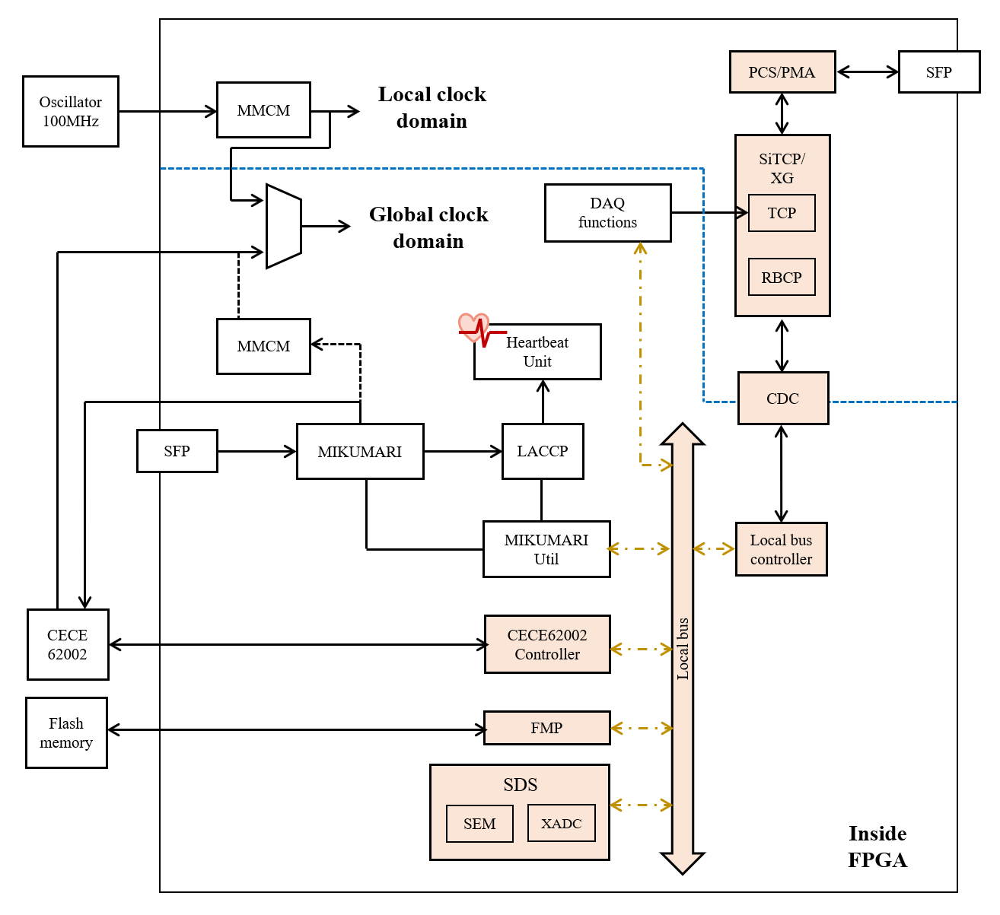
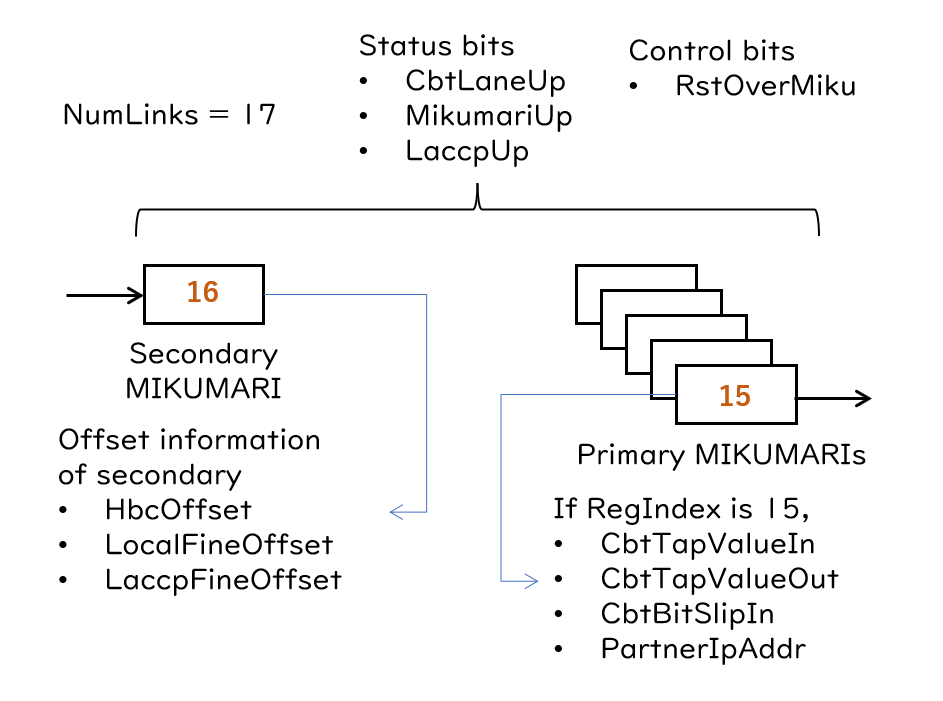

# Overview

AMANEQはファームウェアもHULの物が元になっており、多くの共通点が存在します。[図](#FW-VIEW)にファームウェアの基本構造を示します。PCとの通信を担うSiTCPを起点として、ローカルバスによるスロー制御系、DAQデータ機能ブロック、および時刻同期用のMIKUMARIブロックに分類できます。
図中のオレンジで書かれたブロックは全てのファームウェアで共通のブロックになります。

ローカルバスの構造はHULのそれと完全に同一です。SiTCPのRBCPから内部バスのローカルバスにブリッジして、レジスタの読み書きを行います。
バスブリッジをすることによりデータリンクIFと切り離して、将来的にSiTCP以外のプロトコルを利用する際の利便性を向上させています。
Flash Memory Programmer (FMP)とSelf Diagnosis System (SDS)はHULに実装されている物と同一です。
FMPはフラッシュメモリへMCS/BINファイルをSiTCP経由で書き込むためのブロックです。遠隔モジュールのファームウェア更新に使います。
SDSはモジュールの健全性を調べるブロックです。SEMによるSEU検知とその修復回数の記録とUREの検出を行います。また、XADCを読み、FPGA温度と電源電圧のモニターを行います。
ローカルバスの仕様とFMP/SDSの詳細についてはHULのユーザーガイドを参照してください。

AMANEQファームウェアの特徴は2つクロックドメインが存在することです。
1つは100 MHzの発振器をソースに持つローカルクロックドメインです。このドメインにはDAQ機能とは独立しているデータリンク機能が属しています。
このドメインのクロックはSiTCPやPCS/PMAを駆動するほかにも、フラッシュメモリのSPIポート駆動や、ICAPの駆動にも使われています。DAQ機能と独立したモジュール個々の機能を駆動することが主な仕事です。
2つ目はグローバルクロックドメインです。AMANEQはMIKUMARIによってクロック信号の周波数同期と時刻同期を受けるため、このクロックドメインは上流から送られてきた基準クロック信号をソースに持ちます。
DAQ機能や時刻同期などファームウェアの主要な部分はこのドメインに属します。
AMANEQはMIKUMARIに依存しないスタンドアロンモードをサポートするので、[図](#FW-VIEW)にあるようにグローバルクロックドメインのソースにローカルクロックを用いる事も出来ます。
AMANEQのファームウェアは両方のクロックドメインにクロック信号が存在する事を要求しています。グローバルクロックドメインのクロック信号が存在しない時にAMANEQのファームウェアの機能を動かすことはできません。

グローバルクロックドメインにおいてどのPLLがクロック復元を行うかはファームウェアに依存します。[図](#FW-VIEW)ではMMCMが点線で接続されていますが、実際のファームウェアではMMCMかCDCE62002どちらか一方が使われています。


{: #FW-VIEW width="80%"}

## Data link
AMANEQではGbEの[SiTCP](https://www.sitcp.net/)と10GbEの[SiTCP-XG](https://www.bbtech.co.jp/products/sitcp-xg-license/)の両方をサポートしています。詳しくはリンク先の資料を参照してください。
ファームウェアのユーザーにとってこれら2種類の使用感に違いはありません。RBCPのインターフェースやTCPの受信方法は同一です。唯一の違いはデフォルトIPアドレスが異なる事です。

- SiTCP: 192.168.10.16
- SiTCP-XG: 192.168.10.10

SiTCPとSiTCP-XGは異なった製品のためライセンスも異なるので、同じAMANEQで両方を使うケースがある場合は両方のライセンスを購入しておく必要があります。
例えば、SiTCPを使っているStr-LRTDCからStr-HRTDCへファームウェアを入れ替えた場合、SiTCP-XGのライセンスをEEPROMへ書き直し、IPアドレスも設定しなおす必要があります。

ファームウェア開発者にとって両者は大きく異なります。まず使用するPCS/PMAのコアが異なるので、必要なクロック信号の種類も異なり単純な入れ替えにはなりません
SiTCPはコアクロックの周波数をある程度任意に選ぶことが出来ましたが、SiTCP-XGの場合はPCS/PMAのコアクロックをつなぐ事が想定されています。
そのため、クロックドメインの構造も変わりえます。AMANEQのファームウェアではSiTCPとSiTCP-XGでクロックドメインの構造が変わらないように設計しています。

## Reset signals

### SiTCPコアを使用しているファームウェアの場合

AMANEQでは3種類のリセットが存在し、それぞれリセット対象となる範囲が異なります。下に行くほど強力なリセットです。HULに存在していたSiTCPリセットは期待通りの動きをしていなかったようなので廃止しました。
BCTリセットとハードリセットはHULのそれとはリセット範囲が異なります。

- **BCTリセット**: BCTのResetアドレスにRBCPで書き込みを行う事で発行するリセット信号。DAQ機能などユーザー回路部分のリセットを行います。
- **MIKUMARIリセット**: 上流のモジュールからMIKUMARI経由で発行するリセット信号。BCTリセットの範囲に加えて、SiTCPのコアとローカルバスのリセットを行います。SiTCPがハングアップした時に使用します。
- **ハードリセット**: 基板上のSW2を押下する事で発行するリセット信号。BCTリセットに加えてMIKUMARIとLACCPのリセットを行います。**ハードリセットはSiTCPコアのリセットを行いません。**

この他に内部的には電動投入時に一度だけ発行されるリセットが存在し、PCS/PMAとGTXトランシーバは電源投入時に初期化されたら、能動的にリセットすることはできません。
SiTCPコアはこの電源投入時リセットとMIKUMARIリセットでみ初期化が可能です。

### SiTCP-XGコアを使用しているファームウェアの場合

ハードリセットでSiTCP-XGコアのリセットが可能です。他のリセット範囲についてはSiTCPコア版と同様です。
SiTCP-XG版ではローカルクロックドメインのクロック信号をPCS/PMAから取得しています。そのため、システムリセットが発行される条件にPCS/PMAの状態が含まれています。

## Common local bus modules

AMANEQのファームウェアではローカルバス経由でアクセスできるモジュールの事をローカルバスモジュールと呼びます。
これらの内、Local Bus Controller (BCT)、FMP、およびSDSについてはHULのユーザーガイドも参照してください。
以降**kAddr**で始まる単語はソフト側で指定する32ビット超ローカルバスアドレス (= RBCPアドレス)を指し、*kAddrXXX*へ書き込む (読み出す)と書かれていたら、PCからそのローカルバスアドレスへ読み書きする動作を示しています。
ソフトウェアの基本ライブラリは[hul-common-lib](https://github.com/spadi-alliance/hul-common-lib)にまとめられており、RBCPレベルの通信はUDPRBCPクラスで、ローカルバスレベルの通信はFPGAModuleクラスで記述されています。
以降では、断りが無い限りローカルバスモジュールへの読み書きはFPGAModuleクラスのWriteModuleとReadModuleで行うとします。

ローカルバスの32-bitアドレス空間は以下のような構造になっています。
```
| module ID (4-bit) | local address (12-bit) |   reserve (16-bit)   |
```
Module IDは各ローカルバスモジュールを区別するためにもちいます。Local addressはモジュール内部のアドレス値であり、具体的なレジスタであったり動作であったりを指します。
RBCPで送受信できるデータは1バイトであるため、9-bit以上のデータ長があるレジスタに対する読み書きが必要な場合複数回RBCPを実行する必要があります。
例えば`0XD030'0000`というアドレス値を持つ16-bit長のレジスタがあったとすると、内部的には1バイト目を指す`0XD030'0000`と2バイト目を指す`0XD031'0000`へ2回アクセスします。
1つのレジスタが2つの以上のアドレスに分割されるとユーザーからの可読性がとても悪くなるため、FPGAModuleクラスでは12-bit local addressの下位4-bit部分のインクリメントとループ処理を隠蔽し、`0XD030'0000`へ1度だけアクセスしするように見せかけます。
もしhul-common-libを用いず自作のソフトを使用する場合、この他バイトアクセスの処理を適切に実装してください。
この事については、HULのユーザーガイドにも参照してください。

### Common module ID

複数のファームウェアで実装されているローカルバスモジュール、例えばFMPやSDSについては共通のモジュールIDが割り当てられています。
また、ソフトウェアの共通化を進めるために、他のプロジェクトで開発が進んでいるRAYRAWとCIRASAMEともモジュールIDを共有しています。
以下が共通モジュールに対するモジュールIDの割り当てです。

|Module ID|Local module|Comment|
|:----:|:----|:----|
|0x0|MikumariUtil (MUTIL)|努力目標。ファームウェアによっては共通になっていない。|
|0x8|Scaler (SCR)|スケーラ機能|
|0x9|Max1932 Controller (BIAS)|RAYRAWとCIRASAMEのみに存在。APDバイアス供給ICの制御モジュール。|
|0xA|RESERVE| |
|0xB|CDCE62002 Controller (C6C)| |
|0xC|Self Diagnosis System (SDS)| |
|0xD|Flash Memory Programmer (FMP)| |
|0xE|Local Bus Controller (BCT)| |
|0xF|SiTCP予約領域| |

### CDCE62002 Controller (C6C)

|Register name|Address|Read/Write|Bit width|Comment|
|:----|:----|:----:|:----:|:----|
|kAddrTxd|0x90000000|W|32|CDCE62002へ送信するSPIメッセージ|
|kAddrRxd|0x90100000|R|32|CDCE62002から取得したSPIメッセージ|
|kAddrExecWrite|0x91000000|W|-| |
|kAddrExecRead|0x92000000|R|-| |

CDCE62002 jitter clearの設定を行うためのモジュールです。
CDCE62002は32-bit長のメッセージを使ったSPIによるレジスタアクセスを行います。メッセージ構造はICのデータシートを参照してください。
レジスタ書き込みは*kAddrWxd*へ送信メッセージをセットしておき、*kAddrExecWrite*へ書き込みを行うとSPIシーケンスが走って書き込みが実行されます。
レジスタ読み出しは*kAddrWxd*へ読み出しコマンドをセットしておき、*kAddrExecRead*を実行した後*kAddrRxd*から読み出し結果を読み取ります。

CECE62002は多数の設定項目があるためこれらの読み書きのシーケンスはhul-common-libのCDCE62002Funcsにまとめられています。いくつかの良く使う周波数設定に対するプリセットも用意されています。
通常ユーザーが使う実行体はset_cdce62002のみです。自分でICの設定を変えたい場合はCDCE62002Funcsの記述を参考にして新しくプログラムを作ってください。

このモジュールからCDCE62002へ基準クロックを送信します。どのクロックを基準クロック信号として用いるかはファームウェアによります。


### MIKUMARI Util (MUTIL) (2025.01.06)

|Register name|Address|Read/Write|Bit width|Comment|
|:----|:----|:----:|:----:|:----|
|kAddrCbtLaneUp|0x00000000|R|32|各ビットがMIKUMARIの物理層(CBT)の状態を示します。1で物理層がレディの状態です。どのビットがどのポートに対応するのか、何ビット目まで有効であるかは各ファームウェアに依存します。|
|kAddrCbtTapValueIn|0x00100000|R|5|CBTに設定されているIDELAYのタップ値を読み取ります (RegIndexによる指定が有効)|
|kAddrCbtTapValueOut|0x00200000|W|5|CBTに設定するべきIDELAYのタップ値を与えます (RegIndexによる指定が有効)|
|kAddrCbtBitSlipIn|0x00300000|R|4|CBTが行ったビットスリップの回数を読み取ります (RegIndexによる指定が有効)|
|kAddrCbtInit|0x00400000|W|32|CBTへ初期化命令を送ります。各ビットが各ポートへの初期化信号になっており、1で初期化の実行です。どのビットがどのポートに対応するのか、何ビット目まで有効であるかは各ファームウェアに依存します。|
|kAddrMikumariUp|0x00500000|R|32|各ビットがMIKUMARIリンクの状態を示します。1でリンクアップの状態です。どのビットがどのポートに対応するのか、何ビット目まで有効であるかは各ファームウェアに依存します。|
|kAddrLaccpUp|0x00600000|R|32|各ビットがLACCPの状態を示します。1で時刻同期が完了した状態です。どのビットがどのポートに対応するのか、何ビット目まで有効であるかは各ファームウェアに依存します。|
|kAddrPartnerIpAddr|0x00700000|R|32|接続先のSiTCPのIPアドレスを取得します（RegIndexによる指定が有効)|
|kAddrHbcOffset|0x00800000|R|16|Heartbeat counterへ与えらられたオフセット値を取得します。(LACCPのセカンダリ側のみ有効)|
|kAddrLocalFineOffset|0x00900000|R|16|LACCPが算出したlocal fine offsetを取得します。(LACCPセカンダリ側のみ有効)|
|kAddrLaccpFineOffset|0x00A00000|R|16|LACCPが算出したLACCP fine offsetを取得します。（LACCPセカンダリ側のみ有効)|
|kAddrHbfState|0x00B00000|W/R|1|ハートビートフレーム状態を設定します。1でDAQ running、0でDAQ idleです。そのクロック分配ネットワークのrootモジュールでのみ有効。|
|kAddrRstOverMiku|0x00C00000|W|32|下流モジュールに対して[MIKUMARIリセット](#reset-signals)を発行する。1でリセット発行。|
|kAddrClockRootMode|0x00D00000|R|1|Mikumari Clock Hub moduleでは、ROOTモードで起動している場合1を返します。TDCなどのleaf moduleではstandalone modeで起動している場合1を返します。|
|kAddrRegIndex|0x01000000|W/R|6|いくつかのレジスタにおいて読み書きを行う対象のポート番号を指定します。|
|kAddrNumLinks|0x02000000|R|6|そのファームウェアが備えているMIKUMARIリンクの数を取得します。|

[MIKUMARIリンクプロトコル](https://github.com/RyotaroHonda/mikumari)やLACCPのステータス参照や、制御を行うためのユーティリティモジュールです。
デフォルトのモジュールIDは0x0ですが、ファームウェアによっては守られていない事があります。各ファームウェアのマニュアルをチェックしてください。
ファームウェア上に存在するMIKUMARIポートの状態監視を一括で行います。
上流からクロックを受信するMIKUMARIセカンダリと、復元クロック信号を下流へ再送信するMIKUMARIプライマリとでは取得できる情報が一部異なります。
MikumariClockHubを例とした取得可能な情報のまとめを[図](#MUTIL)に示します。この例ではMIKUMARI linkの数は17です。
0から15がプライマリに割り振られており、16がセカンダリです。ステータスビットや制御ビットは全ポートを一括で指します。
常にセカンダリから情報を取るレジスタと、RegIndexによって参照先が変わるレジスタが存在します。この例ではRegIndexは15に設定されています。

ユーザー用に用意されているMUTIL用の実行体はhul-common-libのshow_mikumariとshow_laccpです。どちらも情報をまとめてコンソール上に標準出力します。

{: #MUTIL width="70%"}

### Flash Memory Programmer (FMP)

ボード上のFlashメモリにMCS/BINファイルを書き込むためのモジュールです。
HULのFMPと完全に同一のため、詳しくはHULのユーザーガイドを参照してください。

### Self Diagnosis System (SDS)

SEMとXADCを使った自己診断モジュールです。
詳しくはHULのユーザーガイドを参照してください。

### Local Bus Controller (BCT)

ローカルバスマスタです。外部データリンクと内部バスのバスブリッジを行います。
FPGAのリコンフィグ要求、バージョンと固有名の取得、BCTリセットの発行を行えます。
詳しくはHULのユーザーガイドを参照してください。

