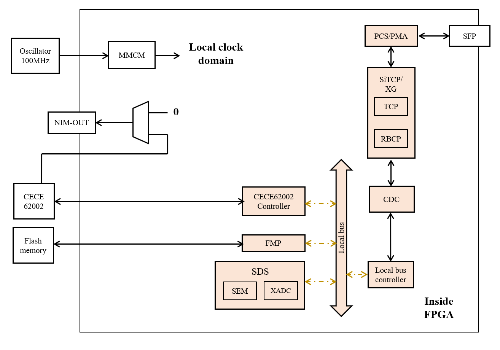

# Skeleton firmware

## Overview

Skeleton firmwareは限られた機能だけが実装されたAMANEQファームウェアのひな型です。
MIKUMARIやDAQ機能は実装されておらず、このモジュールで何かDAQを行う事は出来ません。
納品されたAMANEQの動作チェック、SiTCP通信の確認、CDCE62002の設定などに使用してください。

[Github repository](https://github.com/spadi-alliance/AMANEQ-Skeleton)

```
- Unique ID:                  0xA000

- Link protocol:              SiTCP
- Default IP:                 192.168.10.16
- Data link speed:            1Gbps
```

### History

|Version|Date|Changes|
|:----:|:----|:----|
|v2.2|2024.4.11|事実上の初期版|

## Functions

{: #FW-VIEW width="80%"}

[図](#FW_VIEW)はSkeletonファームウェアのブロック図です。
AMANEQファームウェアの共通部分のみ実装されており、MIKUMARIは非搭載です。
そのため、クロックドメインは1種類だけ存在します。
AMANEQ単体で必ず動作するファームウェアのため、CDCE62002へのアクセスやフラッシュメモリへのアクセスなどを確実に行いたい時に使用します。
また、ファームウェア開発する際のベースファームウェアとしても利用してください。

### LED and DIP switch

MIKUMARIシステムを利用している場合、1-3番がすべて点灯していれば正常です。
スタンドアロンの場合、1番と3番が点灯していれば正常です。

|LED #||Comment|
|:----:|:----|:----|
|1| CDCE locked| CDCE62002のロック状態です |
|2| MMCM locked| MMCMのロック状態です。点灯していればファームウェアは正常に動作しています。 |
|3| TCP connection| TCP接続状況です |
|4| Not in use| |

|DIP #||Comment|
|:----:|:----|:----|
|1| SiTCP IP setting | 0: デフォルトIPを使用します <br> 1: ユーザー設定のIPを使用します (要ライセンス)。|
|2| NIMOUT setting | 0: NIMOUTから何も出力しません <br>1: NIMOUTからCDCE62002のクロック信号を出力します|
|3| Not in use | |
|4| Not in use | |

## Local bus modules

Str-LRTDCには3個のローカルバスモジュールが存在します。
以下がローカルバスアドレスのマップです。

|Local Module|Address range|
|:----|:----|
|CDCE62002 Controller    |0xB000'0000 - 0xBFFF'0000|
|Self Diagnosis System   |0xC000'0000 - 0xCFFF'0000|
|Flash Memory Programmer |0xD000'0000 - 0xDFFF'0000|
|Bus Controller          |0xE000'0000 - 0xEFFF'0000|