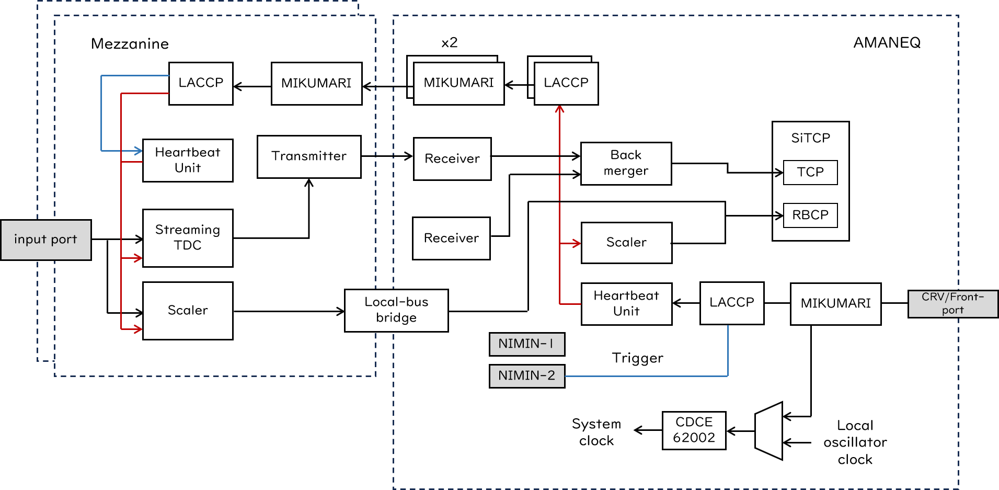
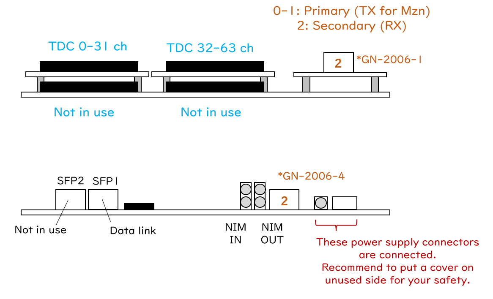
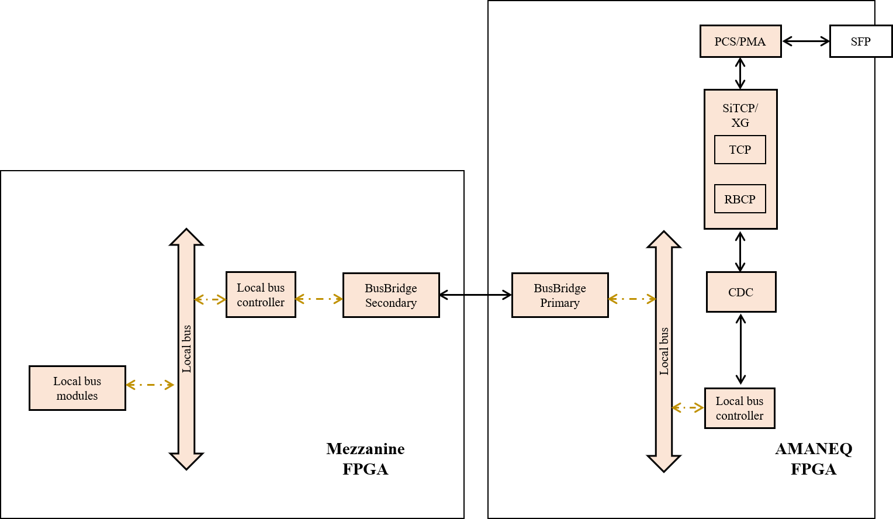
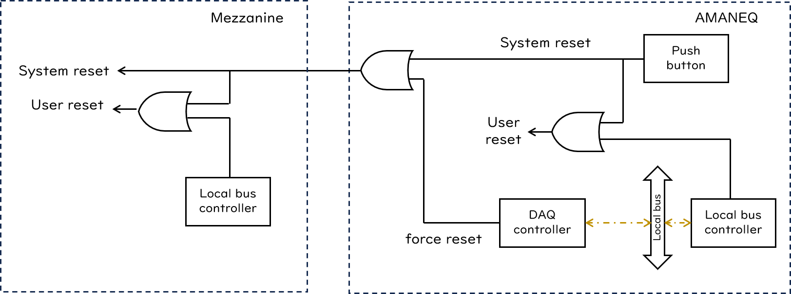

# Streaming high-resolution TDC

## Overview

Streaming high-resolution TDC (Str-HRTDC)は20ps精度の連続読み出しTDCです。
専用のメザニンカードであるmezzanine HR-TDCカードが必要で、メザニン上のFPGAとAMANEQ本体のFPGAが連携して動作する事で1つのモジュールとして動作します。
それぞれのファームウェアを区別するときはAMANEQ側をStr-HRTDC Base、メザニン側Mezzanine (Mzn) Str-HRTDCと表記します。

[Github repository (AMANEQ)](https://github.com/AMANEQ-official/StrHrTdcBase)

[Github repository (Mezzanine)](https://github.com/AMANEQ-official/MznStrHrTdc)

```
- Unique ID (AMANEQ):         0xC480
- Unique ID (Mezzanine):      0x804c

- Number of inputs:           64
- Timing measurements:        Both edges
- TDC precision:              ~23ps
- Double hit resolution:      ~2ns
- Max TOT length:             4000ns

- Link protocol:              SiTCP-XG
- Default IP:                 192.168.10.10
- Data link speed:            10Gbps

- Data word width:            64bit
- Acceptable max input rate:  ~125MHz/board
- System clock freq.:         125MHz
```

### History

|Version|Date|Changes|
|:----:|:----|:----|
| AMANEQ |||
|v2.4|2024.6.4|事実上の初期版|
|v2.5|2025.1.6| - Updating LACCP (v2.1) supporting the frame flag distribution. <br> - Introducing gated scaler. |
| Mezzanine |||
|v2.4|2024.6.4|事実上の初期版|
|v2.5|2025.1.6| - Updating LACCP (v2.1) supporting the frame flag distribution. <br> - Introducing gated scaler. <br> - Introducing IO manager block arranging input/output paths to the NIM IO. <br> - Deprecating DIP2 function. |

## Functions

{: #BL-DIAGRAM width="100%"}

[図](#BL-DIAGRAM)はStr-HRTDCの簡易ブロックダイアグラムです。
AMANEQ側にデータリンクとMIKUMARIポートが存在するため、外部との通信や同期はAMANEQが行います。
メザニンとはメザニンベースコネクタを通じてつながっており、複数の通信プロトコルでAMANEQ上のFPGAと通信を行います。
Str-HRTDC Base上にはMikumariClockHubと同様にクロックを受信するためのLACCPと再送信するためのLACCPが存在し、まずAMANEQ上の時刻を同期して、更にメザニン上の時刻同期を行います。
そのため、Str-HRTDC上には3つの時刻ドメインが存在し、各々が内部のハートビートカウンターを頼りに動いています。

Str-HRTDC Base上にはstreaming TDCの機能の内back merger以降の機能が実装されており、メザニンカードからデータを集めてSiTCP-XGを通じてPCへ送信する事が役割です。
AMANEQ本体には時間を測定する機能は実装されておらず、メザニンカードを搭載していない場合何もできません。
Scalerは限定的な情報を記録しているのみです。詳しくは後述します。
Base ファームウェアはスタンドアロンモードを実装しており、AMANEQ単体で動作する事が可能です。
システムクロック信号の生成にはCDCE62002を使用しているので、**CDCE62002を未設定のAMANEQではこのファームウェアは動作しません。**
125 MHzの入力から500 MHzと125 MHzのクロック信号を生成するようにCDCE62002を設定してください。

Str-HRTDCとしての主機能は殆どがメザニン上のFPGAに実装されています。
メザニンカードにつき32ch入力が可能です。
**入力信号規格はLVDSのみです。AMANEQ本体とは違い、ECLやPECLはサポートしていません。**
メザニン上のstreaming TDCブロックにはfront-mergerまでが実装されており、時間分解能が20psである事以外は、構造的に殆どStr-LRTDCと同様です。
Streaming TDCとしての基本的な動作についてはStr-LRTDCを参照してください。
Scaler機能についてもStr-LRTDCと同様ですが、システムインフォメーションを2つのメザニンカードは独立に記録しているので、その取扱いに注意が必要です。これについても後述します。

本ファームウェアに搭載されている通信プロトコルはSiTCP-XGです。
**Gigabit Ethernetでは動作しません。相手側も10Gigabit Ethernetで通信可能な機器である必要があります。**
また、auto-negotiationは働かないです。

{: #PORT-MAP width="80%"}

[図](#PORT-MAP)はTDC入力チャンネル番号とMIKUMARIのポート番号を示しています。
MIKUMARIのポートは、0番がupper mezzanine、1番がlower mezzanine、2番が受信用のポートにアサインされています。

### LED and DIP switch (2025.01.06)

MIKUMARIシステムを利用している場合、1-3番がすべて点灯していれば正常です。
スタンドアロンの場合、1番と3番が点灯していれば正常です。

|LED #||Comment|
|:----:|:----|:----|
|1| DAQ is running| データ読み出し中である事を示します。 |
|2| Ready for DAQ| 時刻同期が完了し、DAQを走らせられる状態である事を示します。 |
|3| MIKUMARI (2) link up| MIKUMARIポートの2番がリンクアップしている状態です。 |
|4| PLL locked| 全ての内部クロック信号が正常に出力されている状態です。 |


Str-HRTDC Baseは2枚ともメザニンカードを搭載しているケースと、upper slotにだけメザニンカードを搭載しているケースをサポートしています。
Lower slotにだけメザニンカードを搭載すると動作しません。
**搭載メザニン数に応じてDIP 3番を適切に設定してください。**

|DIP #||Comment|
|:----:|:----|:----|
| AMANEQ |||
|1| SiTCP IP setting | 0: デフォルトIPを使用します <br> 1: ユーザー設定のIPを使用します (要ライセンス)。|
|2| Standalone mode | 0: MIKUMARIシステムを使用します<br>1: ローカル発振器を使用しスタンドアロンモードになります|
|3| Lower Mzn absent | 0: 2枚ともメザニンカードを搭載している場合 <br> 1: Upper mezzanine slowのみ使用している場合|
|4| Not in use | |
| Mezzanine |||
|1| Not in use | |
|2| Not in use | |
|3| Not in use | |
|4| Not in use | |

## Local bus modules

Str-HRTDCでは2つのFPGAが接続されているので、メザニン側のFPGAを制御するためにlocal busの拡張が必要になります。
2つのFPGAは[図](#BUS-BRIDGE)に示すようにbus bridge primary/secondaryを通じて接続されています。
AMANEQ側のbus bridge primary (BBP) はlocal bus moduleです。
AMANEQ側から見るとメザニンFPGAへの通信はBBPへの読み書きに見えます。
一方、メザニン側のbus bridge secondaryはlocal bus controllerから見ると外部リンクに見えます。

BBPを介してのアクセスには通常の通信よりも余計に手順がかかります。
そのため、hul-common-libで用意している読み書き用の実行体では煩雑になってしまうため、amaneq-softで一連の通信をまとめたwrite/read_mzn_registerという実行体を用意しています。
メザニンFPGAへアクセスするときはこの実行体を使用してください。

メザニンベースコネクタを介して2つのFPGAつながっているため、しっかりつながっていないと通信エラーを起こします。
一度エラーを起こすとlocal busが応答しなくなるため、リセットボタンによるハードウェアリセットか、MIKUMARIによる遠隔リセットが必要になります。

{: #BUS-BRIDGE width="80%"}

Str-LRTDC Baseには8個のローカルバスモジュールが存在します。
以下がローカルバスアドレスのマップです。

|Local Module|Address range|
|:----|:----|
|Mikumari Utility        |0x0000'0000 - 0x0FFF'0000|
|DAQ Controller          |0x2000'0000 - 0x2FFF'0000|
|BusBridgePrimary upper  |0x3000'0000 - 0x3FFF'0000|
|BusBridgePrimary lower  |0x4000'0000 - 0x4FFF'0000|
|IO Manager              |0x5000'0000 - 0x5FFF'0000|
|Scaler                  |0x8000'0000 - 0x8FFF'0000|
|CDCE62002 Controller    |0xB000'0000 - 0xBFFF'0000|
|Self Diagnosis System   |0xC000'0000 - 0xCFFF'0000|
|Flash Memory Programmer |0xD000'0000 - 0xDFFF'0000|
|Bus Controller          |0xE000'0000 - 0xEFFF'0000|

Mezzanine Str-LRTDCには5個のローカルバスモジュールが存在します。
メザニン側は使用するアドレスのレンジが異なっています。

|Local Module|Address range|
|:----|:----|
|Mikumari Utility        |0x0000 - 0x0FFF|
|DAQ Controller          |0x1000 - 0x1FFF|
|Streaming TDC           |0x2000 - 0x2FFF|
|Scaler                  |0x8000 - 0x8FFF|
|Self Diagnosis System   |0xC000 - 0xCFFF|
|Bus Controller          |0xE000 - 0xEFFF|

## Module reset

{: #RESET width="80%"}

[図](#RESET)にStr-HRTDCのリセット系統を示します。
リセットボタンはAMANEQとメザニン上のFPGA両方にリセットを発行する最も強力な方法ではありますが、MIKUMARIを含めてすべてのブロックをリセットしてしまうので、実験中に気軽に押すことはお勧めしないです。
最終手段として使ってください。
遠隔でモジュールリセットを行う場合は以下の手順で行ってください。

- Local busが正常に応答する場合
    1. Mezzanineのlocal bus controller (BCT) からユーザーリセットを発効する
    2. AMANEQのBCTからユーザーリセットを発行する
- Mezzanine側のlocal busが正常に応答しない場合
    1. DAQ controller からforce resetを発行しメザニンを初期化する
    2. AMANEQ側のBCTからユーザーリセットを発行する
- AMANEQ側のlocal busが正常に動作しない場合
    1. MIKUMARI経由でAMANEQへリセットを行う
    2. DAQ controller からforce resetを発行しメザニンを初期化する

いずれの場合においても、リセット後にamaneq-softのinitializeを実行してdaq data receiverとtapped-delay lineのLUTの校正を行ってください。

## Streaming-TDC block

Streaming TDCの基本構造はStr-LRTDCと同様です。まずは、Str-LRTDCのページを参照してください。
ここではHR-TDCに特有の事を記述します。
また、tapped-delay lineによる高分解能時間測定については[HULのユーザーガイド](https://hul-official.gitlab.io/hul-ug/firmware/main/#mezzanine-hr-tdc-hul-hr-tdc-base)も参考にしてください。

### Data Receiver

メザニン側はDAQデータをDDR transmitterを通して8 GbpsでAMANEQ側へ転送します。
データをAMANEQ側で受け取るためにはDDR receiverを初期化する必要があり、電源投入後とモジュールリセット後にはamaneq-softのinitialize実行体を使って初期化してください。

### Data merging block

Str-HRTDCではfront-mergerとback-mergerが物理的に2つのFPGAに分かれているため、限られた信号線でstreaming TDC全体を制御しています。
そのため、高負荷になった時の制御がうまくいかずデータ破損がStr-LRTDCに比べると起こりやすいです。
また、破損が発生した時に復帰がうまくいかない事もあります。
多くの場合で、データ破損はback-merger上のlocal heartbeat frame number mismatchとして検出されます。
Self recovery modeをONにしている場合、この時自動復帰を試みますが、前述のように自動復帰できない事があります。
Delimiter flagsを監視し、このエラーが発生し続けるようであればDAQを止めてモジュールリセットを試みてください。

### Clock synchronization

2つのメザニン上のFPGAのシステムクロックは、AMANEQ上のシステムクロックに対してそれぞれ異なった位相を持っています。
Back-merger上でハートビートフレームを結合するためには、あらかじめLACCP fine offsetによって時刻補正を行っている必要があります。
そうしないと、位相関係の違うフレームを束ねる事になってしまうためです。
LACCP fine offsetは2つのFPGAで異なっており、デリミターワード上のLACCP fine offsetの領域は1つしかないため、オフラインで位相関係をただすことはできません。
**そのため、Str-HRTDCではFPGA内でのLACCP fine offsetによる時刻補正をオフにすることが出来ないようになっています。**

### Throttling

**Str-HRTDCではthrottling 機能はすべてメザニン側のFPGAに搭載されています。**
Str-LRTDCではoutput throttlingはvital blockの最後に実装されていますが、Str-HRTDCではfront-mergerの後に実装されています。
この理由は、メザニン上で動いているstreaming TDCはお互い独立したDAQ機能であるためです。
AMANEQ上のFPGAは2つの独立したモジュールのデータをまとめて、1つのモジュールのように見せかけています。
メザニンを2つ搭載してる際には、**heartbeat frame throttlingの設定が2つのFPGAで同じになるようにしてください。**
AMANEQ側のFPGAには設定できるstreaming TDCの機能は存在しません。

### Data structure
#### TDC data category

```
Str-HRTDC Leading/trailing data word
MSB                                                                                                     LSB
[    6-bit    ][    7-bit    ][           22-bit           ][                   29-bit                   ]
   Data type       Channel                 TOT                                TDC timing

Throttling data word
[    6-bit    ][    7-bit    ][        16-bit        ][        16-bit        ][          18-bit          ]
   Data type       Channel            Reserve            Throttling timing            Zero padding
```

以下は先頭の6-bit data typeのリストです。
Input throttling type-1のデータタイプは予約だけされています。

|6-bit data-type pattern|Type|
|:----:|:----|
|b001011|Leading edge timing|
|b001101|Trailing edge timing|
|b011001|Input throttling type-1 start|
|b010001|Input throttling type-1 end|
|b011010|Input throttling type-2 start|
|b010010|Input throttling type-2 end|

Leading/trailing data wordではLSB精度はTOT、TDCタイミングともに1/1024 ns (~0.98 ps)です。
約1psまでデータビットは用意されていますが、1psの時間分解能を持っているわけではないです。
これはFPGAが持っているtapped-delay lineのcalibration LUTの出力を表現するために必要なビット長がこの桁まであったためです。
TOT領域は22-bit確保されていますが、最大TOT値は4000nsです。それ以上のTOT値が返ってくることはありません。
TDCタイミング領域は内部的には16-bit fine-scale timestamp + 13-bit fine timingとなっています。

Throttling data wordはStr-LRTDCと同様です。

#### Heartbeat delimiter category

Str-LRTDCと同様です。

### Register address map

**2025.01.06　追記**

kHbdUserRegはメザニン側ではなく、AMANEQ側で設定するように変更されました。

|Register name|Address|Read/Write|Bit width|Comment|
|:----|:----|:----:|:----:|:----|
|     |     |      | AMANEQ |    |
|  -  |  -  |  -   | -      | -  |
|     |     |      | Mezzanine |    |
|kAddrControl      | 0x2010     |   W/R|2| Tdc unit control bits (default: 0x0) <br> 1st-bit: Enable to  bypass the calibration LUT. <br> 2nd-bit: Enable automatic page switch for the calibration LUT.|
|kAddrReqSwitch    | 0x2020     |   W  |1| Manually switch the calibration LUT page |
|kAddrStatus       | 0x2030     |   R  |1| Status register of the tdc unit |
|kTdcMaskMain      | 0x2040     |   W/R|32|Channel mask for 0-31ch    (default: 0x0)|
|	  		    | | | | |
|kEnBypass         | 0x2050     |   W/R|2|Enable bypass for 2-us delay buffer and paring unit. (default: 0x0) <br> 1st-bit: Enable bypass for 2-us delay buffer <br> 2nd-bit: Enable bypass for paring unit. |
|	  		    | | | | |
|kTotFilterCtrl    | 0x2060     |   W/R|2|Enable TOT filter. (default: 0x0) <br> 1st-bit: Enable TOT filter unit <br> 2nd-bit: Enable zero-TOT through mode|
|kTotMinTh         | 0x2070     |   W/R|22|TOT filter low threshold|
|kTotMaxTh         | 0x2080     |   W/R|22|TOT filter high threshold|
|	  		    | | | | |
|kTrgEmuCtrl       | 0x2090     |   W/R|2|Set trigger emulation mode. (default: 0x0) <br> 1st-bit: Enable trigger gate mode <br> 2nd-bit: Enable Veto gate mode|
|kTrgEmuDelay      | 0x20A0     |   W/R|8|Set the delay from the trigger (veto) input to opening the trigger (veto) gate. LSB precision is 8ns.|
|kTrgEmuWidth      | 0x20B0     |   W/R|16|Set the trigger (veto) gate width. LSB precision is 8ns.|
|			    | | | | |
|kHbfThrottCtrl    | 0x20C0     |   W/R|4|Set the heartbeat frame throttling condition. <br> 0x0: Disable (default) <br> 0x1: Only data for frame numbers that are multiples of 2 is acquired. <br> 0x2: Only data for frame numbers that are multiples of 4 is acquired. <br> 0x4: Only data for frame numbers that are multiples of 8 is acquired. <br> 0x8: Only data for frame numbers that are multiples of 16 is acquired.|
|			    | | | | |
|<s>kHbdUserReg</s>       | <s>0x20D0</s>     |   <s>W</s>|<s>16</s>| <s>The register value to be embedded to the 2nd delimiter word.</s>|
| | | | | |
|kSelfRecoveryMode | 0x20E0     |   W/R|1| Enable the automatic recovery process for the local heartbeat frame mismatch (default: 0x0). |

**補足説明**

- ControlBits
    - Calibration LUTをバイパスするとraw tap number (0-63)がTDCデータの下位ビット領域に現れますが、デバッグ用の機能のため開発者以外では使用しないでください。
    - 入力が蓄積して次のLUTページが準備できた段階で自動的に新しいページへスイッチするようになります。ONにすることを推奨します。
- ReqSwitch
    - Calibration LUTページをマニュアルでスイッチします。自動スイッチ機能はOFFにしてから実行してください。
- Status
    - 1st-bit: Readiness of the next calibration LUT page
- TdcMask
    - TdcMaskをセットすると該当チャンネルからTDCデータが出力されなくなります。
    - LSB側が若いチャンネル番号に対応します。
    - Scalerへは影響を与えません。
- EnBypass
    - 2-us delay bufferをバイパスする機能は現状DAQ機能に何も変化を与えません。
    - ペアリングユニットをバイパスすると立下りデータが別に返ってきます。
- TotFilter
    - Zero-TOT through modeではたとえ下限値が設定されていたとしてもTOTが0のデータを例外的に通過させます。
    - 閾値設定のLSB精度はTDCと同じ~0.98psです。
- TrgEmu
    - Trigger modeではトリガー入力によりデータを通過させるためのゲートを開きます。Veto modeではベト入力によりデータをブロックするゲートを開きます。
    - kTrgEmuCtrlには0x3を設定できません。
- SelfRecoveryMode
    - Local heartbeat frame number mismatch (delimiter flag 10th bit)が発生した時に自動復帰するプロセスを有効にします。
    - このモードが有効の時local heartbeat frame mismatchが起きると、自動的にDAQ状態をOFFしてデータ送信を止め、データマージングブロックをリセットしてからDAQ状態をONしデータ送信を再開します。
    - ソフトウェアからは数フレームほどデータブロックが抜けたように見えます。

## Scaler

スケーラー機能の概要とデータ構造はStr-LRTDCと同様ですが、Str-HRTDCでは3つのスケーラーが独立に動いています。

- AMANEQのスケーラー
    - Real time, Mikumari error number, Trigger request, Trigger rejected のみを記録しています。
- Mezzanine cardのスケーラー
    - Trigger requestとTrigger rejected以外の全てを2台のFPGAで独立に記録しています。

### Register address map

|Register name|Address|Read/Write|Bit width|Comment|
|:----|:----|:----:|:----:|:----|
|     |     |      |      | AMANEQ |
|     |     |      |      | Same as for Str-LRTDC |
|     |     |      |      | Mezzanine |
|kAddrScrReset  | 0x8000|  W|1| Reset signals <br> 0x1: Local reset <br> 0x2: Global reset <br> 0x4: FIFO reset|
|kAddrLatchCnt0 | 0x8010|  R|1| Send latch request to the free-run scaler unit|
|kAddrLatchCnt1 | 0x8011|  R|1| Send latch request to the gated scaler 1|
|kAddrLatchCnt2 | 0x8012|  R|1| Send latch request to the gated scaler 2|
|kAddrNumCh     | 0x8020|  R|8| Number of words of scaler data block including system information (unit: words)|
|kAddrStatus    | 0x8030|  R|8| Scaler unit status|
|kAddrReadFIFO  | 0x8100|  R|-| Address to read data from FIFO|

**補足説明**

- AddrScrReset
    - Local resetはアクセス先のスケーラーカウントのリセットを行います。
    - Global resetはアクセス先のスケーラーカウントをリセットし、さらにMIKUMARIリンク経由でスケーラーリセット信号を下流モジュールへ送信します。MikuClockRootファームウェアでのみ有効な機能です。
    - FIFO resetはアクセス先のFIFOの中身をリセットします。
- LatchCnt
    - このアドレスへ読み出しアクセスをするとラッチリクエストになります。
    - アドレスによってどのスケーラユニットへラッチリクエストを送信するか決まります。
- NumCh
    - スケーラーデータブロックのワード数はファームウェアによって異なるので、何ワード読み出したらよいか知るためのレジスタです。読むべきワード数が得られます。
- Status
    - 1st-bit: FIFO empty
    - others: Reserved
- ReadFIFO
    - 1-byteずつデータをFIFOから読み出すためのアドレスです。
    - - 3種類のスケーラユニットでReadFIFOを共有しています。ラッチリクエストを送信したユニットのデータがFIFOには入っています。

## Mikumari Utility

### Register address map

AMANEQ側のアドレスマップはStr-LRTDCと同様です。
Overviewを参照してください。
以下に、メザニン側のアドレスマップを示します。

|Register name|Address|Read/Write|Bit width|Comment|
|:----|:----|:----:|:----:|:----|
|kAddrCbtLaneUp|0x0000|R|32|各ビットがMIKUMARIの物理層(CBT)の状態を示します。1で物理層がレディの状態です。どのビットがどのポートに対応するのか、何ビット目まで有効であるかは各ファームウェアに依存します。|
|kAddrCbtTapValueIn|0x0010|R|5|CBTに設定されているIDELAYのタップ値を読み取ります (RegIndexによる指定が有効)|
|kAddrCbtTapValueOut|0x0020|W|5|CBTに設定するべきIDELAYのタップ値を与えます (RegIndexによる指定が有効)|
|kAddrCbtBitSlipIn|0x0030|R|4|CBTが行ったビットスリップの回数を読み取ります (RegIndexによる指定が有効)|
|kAddrCbtInit|0x0040|W|32|CBTへ初期化命令を送ります。各ビットが各ポートへの初期化信号になっており、1で初期化の実行です。どのビットがどのポートに対応するのか、何ビット目まで有効であるかは各ファームウェアに依存します。|
|kAddrMikumariUp|0x0050|R|32|各ビットがMIKUMARIリンクの状態を示します。1でリンクアップの状態です。どのビットがどのポートに対応するのか、何ビット目まで有効であるかは各ファームウェアに依存します。|
|kAddrLaccpUp|0x0060|R|32|各ビットがLACCPの状態を示します。1で時刻同期が完了した状態です。どのビットがどのポートに対応するのか、何ビット目まで有効であるかは各ファームウェアに依存します。|
|kAddrPartnerIpAddr|0x0070|R|32|接続先のSiTCPのIPアドレスを取得します（RegIndexによる指定が有効)|
|kAddrHbcOffset|0x0080|R|16|Heartbeat counterへ与えらられたオフセット値を取得します。(LACCPのセカンダリ側のみ有効)|
|kAddrLocalFineOffset|0x0090|R|16|LACCPが算出したlocal fine offsetを取得します。(LACCPセカンダリ側のみ有効)|
|kAddrLaccpFineOffset|0x00A0|R|16|LACCPが算出したLACCP fine offsetを取得します。（LACCPセカンダリ側のみ有効)|
|kAddrHbfState|0x00B0|W/R|1|ハートビートフレーム状態を設定します。1でDAQ running、0でDAQ idleです。そのクロック分配ネットワークのrootモジュールでのみ有効。|
|kAddrRegIndex|0x0100|W/R|6|いくつかのレジスタにおいて読み書きを行う対象のポート番号を指定します。|
|kAddrNumLinks|0x0200|R|6|そのファームウェアが備えているMIKUMARIリンクの数を取得します。|

## DAQ Controller

DAQ Controllerはmezzanine card側のDDR transmitterとAMANEQ側のDDR receiverの初期化を行う事が役割です。
電源投入後やモジュールリセット後にamaneq-softのinitialize実行体を使って初期化してください。
また、メザニンカード側では最初のcalibration LUTページを作るための補助も行います。
ユーザーが各レジスタに個別にアクセスする事はないと思われます。

### Register address map

**2025.01.06 追記**

Heartbeat delimiterへのuser register設定はAMANEQ側のDAQ Controllerで設定する事になりました。

|Register name|Address|Read/Write|Bit width|Comment|
|:----|:----|:----:|:----:|:----|
|  AMANEQ   |     |      |      | AMANEQ |
|kAddrInitDDR   | 0x2020'0000|  W  |1| Assert DDR receiver initialize signal|
|kAddrCtrlReg   | 0x2030'0000|  W/R|6| DDR receiver control register <br> 1st-bit: Enable test mode upper <br> 2nd-bit: Enable test mode lower <br> 3rd-bit: Enable upper slot <br> 4th-bit: Enable lower slot <br> 5th-bit: Force reset upper <br> 6th-bit: Force reset lower|
|kAddrRcvStatus | 0x2040'0000|  R  |4| Receiver status <br> 1st-bit: Bit aligned upper <br> 2nd-bit: Bit aligned lower <br> 3rd-bit: BitError upper <br> 4th-bit: Bit error lower|
|kHbdUserReg    | 0x2050     |  W  |16| The register value to be embedded to the 2nd delimiter word|
|  Mezzanine   |     |      |      | Mezzanine |
|kAddrCtrlReg   | 0x1000     |  W/R|1| Enable transmitter test mode |
|kAddrExtraPath | 0x1010     |  W/R|1| Calibrate the LUT for tapped-delay line with the clock signal |

## IO Manager

IO ManagerはAMANEQのNIM IOとFPGA内部の信号等の接続関係を管理するモジュールです。
NIMポートから入力された信号をどの内部信号へ接続するか、また内部信号をどのNIMポートから出力するかをSiTCPを通じて変更します。

|Register name|Address|Read/Write|Bit width|Comment|
|:----|:----|:----:|:----:|:----|
|kFrameFlag1In  | 0x50000000|  W/R|2| Setting the NIM-IN port to the internal frame flag-1 signal. It is valid when the module is the standalone mode. (default 0x0)|
|kFrameFlag2In  | 0x50100000|  W/R|2| Setting the NIM-IN port to the internal frame flag-2 signal. It is valid when the module is the standalone mode. (default (0x1))|
|kTriggerIn     | 0x50200000|  W/R|2| Setting the NIM-IN port to the internal trigger in signal. (default (0x3))|
|kScrResetIn    | 0x50300000|  W/R|2| Setting the NIM-IN port to the internal scaler reset signal. This signal will be distributed to the mezzanine cards through MIKUMARI. (default (0x3))|
| |  |  | | |
|kSelOutSig1    | 0x21000000|  W/R|3| Selecting the internal signal to output from the NIM-OUT port 1. |
|kSelOutSig2    | 0x22000000|  W/R|3| Selecting the internal signal to output from the NIM-OUT port 2. |

アドレス値が`0x20X0'0000`のレジスタはNIM-INポートをどの内部信号へ接続するかを決定します。
各レジスタに対して設定可能な値は以下の通りです。

|Register value|Comment|
|:----:|:----|
|0x0| Connecting the NIM-IN port 1 to the corresponding internal signal.|
|0x1| Connecting the NIM-IN port 2 to the corresponding internal signal.|
|0x2| Not in use |
|0x3| Connecting GND to the corresponding internal signal. |

アドレス値が`0x2X00'0000`のレジスタはどの内部信号をNIM-OUTポートへ接続するかを決定します。
各レジスタに対して設定可能な値は以下の通りです。

|Register value|Comment|
|:----:|:----|
|0x0| Connecting the heartbeat signal.|
|0x1| Connecting the TCP connection establish.|
|0x2| Connecting the trigger signal from LACCP.|
|0x3| Connecting the frame flag-1.|
|0x4| Connecting the frame flag-2.|
|0x5| Connecting the logic of 1|
|0x6| Connecting the logic of 1|
|0x7| Connecting the logic of 1|


