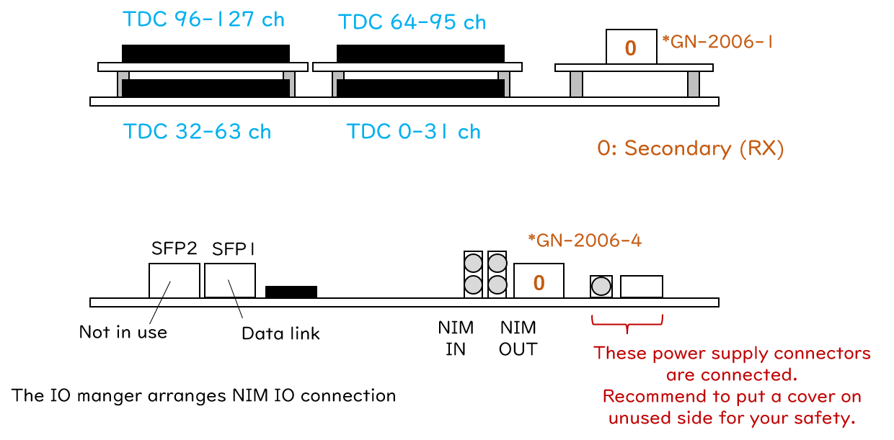
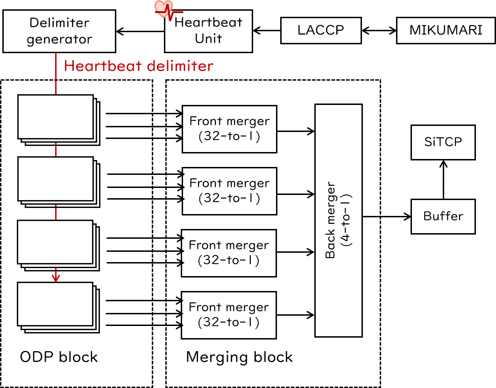
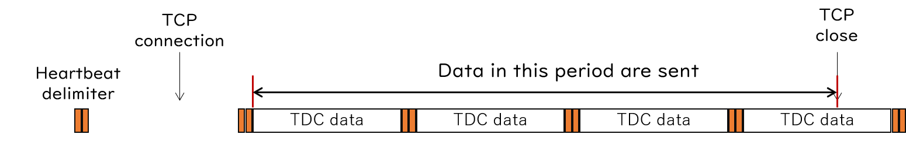
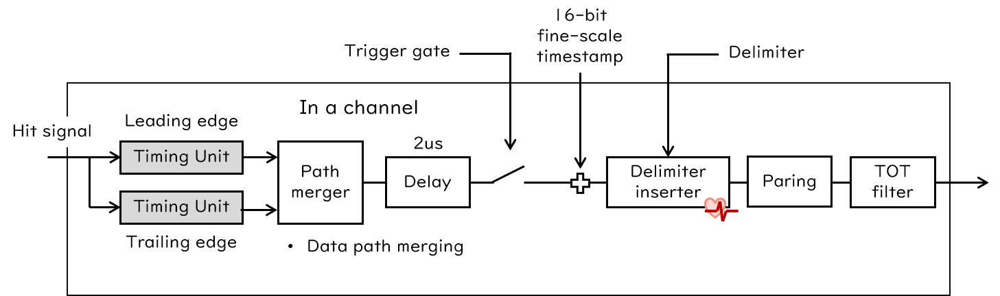
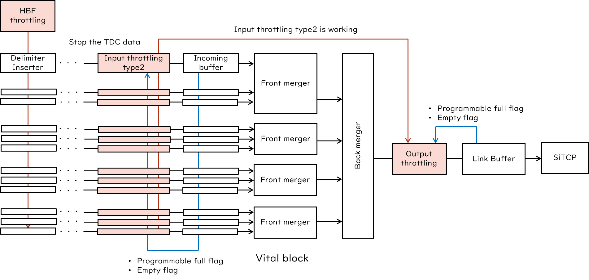

# Streaming low-resolution TDC

## Overview

Streaming low-resolution TDC (Str-LRTDC)は128ch入力の1ns精度連続読み出しTDCです。

[Github repository](https://github.com/AMANEQ-official/StrLrTdc)

```
- Unique ID:                  0x60c4

- Number of inputs:           128
- Timing measurements:        Both edges
- TDC precision:              1ns
- Double hit resolution:      ~8ns
- Max TOT length:             4000ns

- Link protocol:              SiTCP
- Default IP:                 192.168.10.16
- Data link speed:            1Gbps

- Data word width:            64bit
- Acceptable max input rate:  ~14MHz/board
- System clock freq.:         125MHz
```

### History

|Version|Date|Changes|
|:----:|:----|:----|
|v2.8|2025.3.5| - Bugfix version of v2.6. <br> - Enabling the function to generate data words with input throttling type-2 start/end data types. |
|v2.7|        | Missing version |
|v2.6|2025.1.6| - Updating LACCP (v2.1) supporting the frame flag distribution. <br> - Introducing gated scaler. <br> - Introducing IO manager block arranging input/output paths to the NIM IO. <br> - Deprecating the extra 129th TDC input from NIM. <br> - Deprecating DIP2 function.|
|v2.5|2024.6.4|事実上の初期版|

## Functions

{: #BL-DIAGRAM width="80%"}

[図](#BL-DIAGRAM)はStr-LRTDCの簡易ブロックダイアグラムです。
Main inputとメザニンスロットを入力として利用し、最大128ch入力を受け付けます。
AMANEQ本体のみで64ch入力が可能であり、128chまで拡張する場合はDCRv2メザニンカードが必要です。
これらの入力信号は連続読み出しTDC (Str-TDC)ブロックとスケーラーブロックに接続されています。
Str-TDCブロックでは1ns精度で信号のリーディングとトレーリングエッジのタイミングを測定し、内部で2つのエッジのペアリングを行いTOTを計算します。
データ送信はSiTCPのTCP機能を使って行います。
Str-TDCはトリガーレスの連続読み出しTDCですが、トリガー信号によって内部ゲートを生成し、選択的にデータを送信するオプション機能が存在します。
TDCブロックの詳細はDAQ機能のセクションで詳しく述べます。

スケーラーブロックは内部に32-bitカウンタを有しており、TDCブロックの動作とは独立に入力信号の数を数えます。
DAQ機能が動いていない時でも、常に入力数を数え続けるフリーランのスケーラーです。
スケーラーデータはRBCPを使ってUDPで読み出します。
RBCPから読み出しリクエストがあるとカウンタ値をラッチして、タイムスタンプを付与してPCへ送信します。
ユーザーはタイムスタンプを見る事で入力レートの計算をすることが出来ます。

MIKUMARIポートはmini-mezzanine CRV (GN-2006-1の場合)かフロントパネルのSFPポート (GN-2006-4)につながっています。
Str-LRTDCはクロック同期経路上のリーフノードであり、これより下流のモジュールを再同期する能力はありません。
MIKUMARIシステムを用いずにスタンドアロンで動作させるときは、システムクロック信号のソースにローカル発振器を選択してください。

{: #PORT-MAP width="80%"}

[図](#PORT-MAP)はTDC入力チャンネル番号とMIKUMARIのポート番号を示しています。
MIKUMARIのポートはセカンダリが0番にアサインされています。

### LED and DIP switch (2025.01.06)

MIKUMARIシステムを利用している場合、1-3番がすべて点灯していれば正常です。
スタンドアロンの場合、1番と3番が点灯していれば正常です。

|LED #||Comment|
|:----:|:----|:----|
|1| DAQ is running| データ読み出し中である事を示します。 |
|2| Ready for DAQ| 時刻同期が完了し、DAQを走らせられる状態である事を示します。 |
|3| MIKUMARI (0) link up| MIKUMARIポートの0番がリンクアップしている状態です。 |
|4| PLL locked| 全ての内部クロック信号が正常に出力されている状態です。 |

|DIP #||Comment|
|:----:|:----|:----|
|1| SiTCP IP setting | 0: デフォルトIPを使用します <br> 1: ユーザー設定のIPを使用します (要ライセンス)。|
|2| Not in use | |
|3| Standalone mode | 0: MIKUMARIシステムを使用します<br>1: ローカル発振器を使用しスタンドアロンモードになります|
|4| Not in use | |

<!--
- DIP1: SiTCP IP setting
    - 0: デフォルトIPを使用します
    - 1: ユーザー設定のIPを使用します (要ライセンス)。
- DIP2: NIMOUT setting
    - 0: NIMOUT-1からハートビート信号が出力されます
    - 1: NIMOUT-1からLACCPがトリガー信号が出力されます
- DIP3: Standalone mode
    - 0: MIKUMARIシステムを使用します
    - 1: ローカル発振器を使用しスタンドアロンモードになります
- DIP4: Not in use
-->

## Local bus modules

Str-LRTDCには7個のローカルバスモジュールが存在します。
以下がローカルバスアドレスのマップです。

|Local Module|Address range|
|:----|:----|
|Mikumari Utility        |0x0000'0000 - 0x0FFF'0000|
|Streaming TDC           |0x1000'0000 - 0x1FFF'0000|
|IO Manager              |0x2000'0000 - 0x2FFF'0000|
|Scaler                  |0x8000'0000 - 0x8FFF'0000|
|CDCE62002 Controller    |0xB000'0000 - 0xBFFF'0000|
|Self Diagnosis System   |0xC000'0000 - 0xCFFF'0000|
|Flash Memory Programmer |0xD000'0000 - 0xDFFF'0000|
|Bus Controller          |0xE000'0000 - 0xEFFF'0000|

## Streaming-TDC block

### Basic structure of streaming TDC

Str-HRTDCや他の連続読み出し用のファームウェアはStr-LRTDCの構造が基になっています。
ここでは連続読み出しTDCの基本構造についてまず記述します。
伝統的なtriggered-type DAQシステムでは、トリガー信号が基準タイミングとなり、その周辺のデータをまとめる事でイベントデータブロックを形成します。
これがフロントエンド回路の最小データ構造になる事が多いです。
トリガーレスDAQシステムでは、ハードウェアトリガーが存在しないため、イベントをデータブロックの単位に取る事が出来ません。
そこで、[Synchronization](#synchronization)のセクションで述べた時刻の構造をデータブロックにも当てはめます。
ハートビートフレームの1周期を定義しているのは16-bitのハートビートカウンターです。
この16-bitカウンタ値をfine-scaleのタイムスタンプ (8ns精度, 524us長)として各DAQデータワードに与えます。
タイムスタンプとして8ns精度が不十分な場合、システムクロック周期以下の時間測定を補償するためのTDCユニットを実装して更にfine-scaleの時間情報を与えます。

次にデータブロック、つまりハートビートフレームの境目を示すために、ハートビートデリミタと呼ばれる区切りデータワードをハートビート信号のタイミングで挿入します。
ハートビートデリミタはcoarse-scaleのタイムスタンプ (524us精度, 2.4h長)である24-bit長のフレーム番号を持ちます。
また、デリミタデータはそのフレームのステータスサマリーなども持っています。
ハートビートデリミタはハートビートフレームの最後につきます。

{: #DATA-BLOCK width="70%"}

以上の事をまとめると[図](#DATA-BLOCK)のようになります。
Streaming TDCはTDCデータとフレームの区切りを示すデリミタデータを連続的に送信します。

{: #TDC-BLOCK width="65%"}

時刻情報はLACCPによって同期されたheartbeat unitが定義しています。
Streaming TDCはこれを参照するだけで、heartbeat unitを制御することはありません。
**すなわち、時刻情報はDAQ機能とは独立でありフリーランで進み続けるので、DAQにとって特定の時刻基準、例えば0点、などは特に意味がありません。**
Streaming TDCはonline data processing (ODP) ブロックとデータマージングブロックで構成されます。
歴史的な理由から、データマージングブロックをvital blockを呼ぶことがあります。

ODPブロックはTDCユニットを含み、時間測定やTOTの計算などチャンネル毎の処理を固定遅延時間で行います。
Delimiter generatorはデリミタワードを生成し各ODPチャンネルへ分配します。
つまり、ハートビートフレームは各チャンネル毎に定義されます。
データマージングブロックはデータリンクにデータストリームを渡すため、複数のデータパスをまとめあげ単一のデータパスにします。
この過程で、各チャンネル毎に定義されたハートビートフレームは結合され、[図](#DATA-BLOCK)に示すようにモジュール全体のハートビートフレームへとまとめ上げられます。
データマージングブロックではフレーム結合時に各チャネルからやってきたTDCデータを着た順番に新しいフレーム内に並べます。
**そのため、ハートビートフレーム内のデータは時刻でそれなりにソートされていますが、順番がひっくり返っていることがあります。**
データマージングブロックはfront-mergerとback-mergerの2段構成になっており、各マージャ―内には出力FIFOが実装されています。
Front-とback-mergerの機能はserialization factorを除けば同一です。
2段構えになっている理由は同期的に瞬間レートが増加した時にfront-mergerでバッファするためです。

連続読み出しようのFEEにはPCへデータ送信をトリガーする信号は存在しません。
SiTCPは直前のバッファにデータがある限りデータ送信を続けます。
Streaming TDCではハートビートフレームがデータブロックの単位であるため、検出器ヒットが全くない空のハートビートフレームも定義可能です。
そのため、DAQ機能がONの状態では検出器入力の有り無しに関わらず、ハートビートデリミタワードは必ず送信されます。
この点が、トリガー入力が無ければ何もデータを返さない従来のFEEとは異なる点です。

### DAQ running/idle state

Streaming TDCブロックが何もデータを出力しない状態をDAQ idle状態、デリミターデータワードを含むDAQデータの生成をする状態をDAQ running状態と呼びます。
DAQ状態はハートビートフレームのフレーム状態とデータリンク状態の積で決定されます。
ハートビートフレームはアクティブフレームとアイドルフレームの2状態を持っており、LACCPによって管理されています。
ユーザーが変更できるフレーム状態はクロック同期ネットワーク上のroot moduleの物だけです。
ユーザーがroot moduleへアクセスしフレーム状態の更新を行うと、LACCPを通じて下流の全モジュールへ更新が伝達されます。
情報の伝搬遅延の違いによって各FEE上のフレーム状態の切り替わりタイミングが異なってしまう事を避けるために、フレーム状態の分配はハートビート信号の裏打ちタイミング（バックビート）で行われ、反映は次のハートビート信号でなされます。
現状ハートビート周期は524 usのため、root moduleから最も遠いモジュールまでの伝搬遅延が262 us以内であれば、フレーム状態の切り替わりは同時に行われます。

フレーム状態はハートビート単位で切り替わりますが、TCP接続は任意のタイミングで確立するので、データリンク状態の遷移タイミングはハートビートフレームに同期していません。
この事がDAQ状態の遷移タイミングへ影響を与えます。
DAQ状態はOFFからONへ切り替わるときはハートビートを待って遷移しますが、ONからOFFへ切り替わる時は条件を満たさなくなったら即座に遷移します。
この理由は、TCP接続が確立していればデータ送信開始を遅らせることはできますが、接続が切れたら最早データを送りようがないためです。
このことから、DAQ RUN終了時には**ハートビートフレームの途中でデータが途切れる**事がありますが、これを問題視するかどうかはユーザーに委ねています。
また、複数モジュールがある場合、TCP接続が確立するまでの時間は通常ばらつきます。
そのため、DAQ RUNスタート時に各モジュールがデータ送信を開始するフレーム番号は一致するとは限りません。
これを問題視するかどうかも、やはりユーザーに委ねています。
[図](#DAQ-ONOFF)はTCP接続状態でDAQ状態が決まるような運用をした場合に送信されるデータの範囲を示しています。

{: #DAQ-ONOFF width="90%"}

上記の事を問題視し、DAQ状態の切り替わりをハートビートへ同期したい場合、先にTCP接続を確立させておいて後からフレーム状態をアクティブにする必要があります。DAQを止める場合は先にフレーム状態をアイドルへ変更してからTCP接続を切ります。
この場合、各FEEのTCP接続状態を何らかの方法で監視して、すべてのTCP接続が確立したことを確認しないといけません。

一方、各FEEのDAQ状態の切り替わりタイミングに頓着しない場合、先にフレーム状態を更新しておいて、後からTCP接続を確立させることができます。
この場合、中央集権的にTCP接続状態の監視をする必要はありません。
フレーム状態は常にアクティブで、TCP接続状態だけでDAQ状態を定義するという考え方もできます。
SPADI-Aで開発しているNestDAQの実装では、FEEからデータがない場合タイムフレームビルドをタイムアウトする仕様になっているので、こちらの運用方式を採用しているケースが多いです。

#### Standalone mode

DIPスイッチの設定によりスタンドアロンモードで動いている場合は、フレームステートは常にONです。
TCP接続状態だけでDAQ状態が決定されます。

### Frame flags (2025.01.06)

LACCPがハートビートフレーム単位で外部信号（レベル入力）をサンプリングして、その結果をheartbeat frame delimiterのフラグ領域に格納します。
Frame flagsによってTDCが動作を変える事はありません。あくまで状態の記録としてデリミターワード中にフラグビットとして残ります。
想定上の使用方法はゲート信号の記録です。
また、frame flagsは後述のgated scaler駆動のためにも使用します。
MIKUMARIで同期を受けている場合は上流モジュールから送られてきたフラグ情報が、standalone modeの場合はNIM入力からの信号入力の結果がframe flagsとして使用されます。
Synchronizationの章も合わせて参照してください。

### Buffer overflow

DAQ状態がrunningになるとStreaming TDCは即座にデータ送信をし始めるので、ソフト側ではTCP接続の確立後は常に読み出しを行っている事が必要です。
もし、ソフトが何らかの理由によりデータ読み出しを行わない期間があったり、そもとも送信しようとするデータ量がリンクスピードに対して多すぎる場合、フロントエンドはバックプレッシャーを感じFPGA内のFIFOへデータがたまっていきます。
この状態が長く続くと最上流のFIFOまでデータが一杯になり、データドロップを発生します。
このように連続読み出し用のファームウェアではデータドロップはデータリンク以降からのプレッシャーによって発生します。
トリガーがBUSYによってマスクされることでイベントを取得できなくなるグローバルトリガー型のDAQとはこの点が大きく異なります。
プレッシャーが発生する理由は多岐にわたり、全FEEが同期的にデータドロップするとは限りません。
ソフト上の高いイベント再構成効率を維持するためには、FEEのデータ収集（送信）効率は可能な限り100%を維持する必要があります。
データリーダー、データ処理、データ書き込みを行うプロセスは分かれていることが望ましいです。
[hul-common-lib](https://github.com/spadi-alliance/hul-common-lib)で提供しているサンプルDAQコードではデータリードとディスク書き込みを同一プロセス内で行っていますが、あくまで簡易的な試験用であることに留意してください。

バックプレッシャーにより最上流のFIFOまでデータの水面が上がってしまった場合、まずファームウェアはTDCデータの書き込みを遮断し、ハートビートデリミタの送信を優先的に行うようになります。
これはDAQシステムにとってハートビートフレームがデータブロックと時刻の基本単位であり、これを可能な限り失わないようにするためです。
それでもプレッシャーがかかり続けるといずれハートビートデリミタも送信できなくなるので、ファームウェアは様々な方法を使って自身を延命しようと努力します。
データドロップの仕方や延命措置についてはthrottling機能のセクションで詳しく述べます。

### Online Data Processing block

{: #ODP-BLOCk width="100%"}

Online Data Processing (ODP) blockは時間測定やTOTの計算など各チャンネル毎の処理を並列に行うブロックです。
まずtiming unitで検出器からのロジック信号の立ち上がりと立下りエッジの時間測定を行います。このユニットは16-bit fine-scale timestamp以下の精度の時間を測定を行い、その精度はファームウェアによりますが、Str-LRTDCの場合、精度は1nsです。
両エッジの時間測定は独立に行われるので、その後の処理ためにpath mergerで1本のデータパスに統合されます。
この段階ではTOTの計算は行われませんが、非常にパルス幅が短く立ち上がりと立下りの結果が同時にやってきた場合、ここで簡易的なTOT計算を行い立下りエッジのデータは破棄されます。
もし、後述のペアリングモードをOFFにして立下りエッジデータを残すような処理をしていた場合でも、両エッジデータが同時にやってくるような短パルスに対しては立下りエッジのデータを残すことができません。

その後データは2usの固定長ディレイバッファを通過します。
この遅延バッファは、後述の[trigger emulation mode](#trigger-emulation-mode)においてトリガー入力を待つための機能です。

Delimiter inserterの直前で16-bit fine-scale timestampが結合され、ハートビートフレーム内における時刻が確定します。
ハートビートのタイミングでdelimiter wordが挿入されて、各チャンネルにおけるハートビートフレームが構成されます。
Timing unitからここまでの処理は固定長遅延で行われます。

ハートビートフレームが確定したのち、立ち上がりと立下りエッジのペアリングを行います。
Paring unitは立ち上がりデータを見つけると立下りデータが来るまで待ち、立下りデータが来た時点でTOTを計算し立下りデータを破棄します。
結果として、立ち上がりタイミングとTOT値を含んだデータワードが次のユニットへ送られます。
ペアリングのための最大待ち時間は4000nsで、この時間内にペアを見つけられなかった場合、TOTが0の立ち上がりデータが出力されます。
また、連続して立ち上がりデータが来てしまった場合でも、TOTが0の立ち上がりデータが出力されます。
いずれにせよ、TOTが0のデータは何らかの理由によりペアが見つからなかったことを意味します。
もし、立ち上がりと立下りデータの間にデリミタワードが挟まった場合、TDCデータはデリミタワードの前に挿入されます。つまり、ハートビートフレーム内におけるTDCデータの位置は、立ち上がりデータが持つタイムスタンプで決定されます。
ペアリング機能をオフにして、立ち上がりと立下りデータの両方を出力させることも可能ですが、データ転送量は2倍になります。

その後、TDCデータはTOTフィルターを通ります。
TOTフィルターではTOT値に対して下限と上限の閾値を設定して、その範囲に入らなかったTDCデータをフィルターアウトします。
TOTの下限値を設定した場合TOTが0のデータは本来フィルターアウトされてしまいますが、TOTが0のデータは特殊なケースに相当するので、これを特例的に通過させるモードも実装されています。
デフォルトではTOTフィルターはオフになっており、すべてのデータを通過させます。

#### Trigger emulation mode

Streaming TDCはトリガーレスモードが基本ではありますが、データ量削減のためにハードウェアトリガーの入力を受け付けることができます。
トリガーはNIM入力か、MIKUMARI経由で上流のモジュールから受け取ることが可能です。
この機能をオンにしてトリガーを入力するとゲートが開き、ゲートが開いている間だけデータを下流へ送信します。
ゲートが開いている間に次のトリガー (ベト)信号がやってきた場合、ゲート長が延長されます。
トリガー入力からゲートを開くまでの遅延時間と、ゲート長はネットワーク経由で設定可能です。
トリガーレスモードの場合は、このゲートが常に開いている状態に相当します。

### Data merging block (vital block)

[図](#TDC-BLOCK)を再び参照してください。
ODPブロックを出たデータはデータマージングブロックで1つのデータパスへシリアライズされます。
この時、各チャンネルで定義されたハートビートフレーム同士をまとめあげて、1つのフレーム構造を再定義します。
Merger unitのスループットは8Gbpsです。SiTCP-XGを使用している場合、back-mergerのスループットがボトルネックになります。

[図](#TDC-BLOCK)中の灰色の四角はFIFOを示しています。
Merger unitは順番にデータをまとめていくので、入力の前にFIFOがある構造になっています。
ODPブロックからのデータを最初に受けるFIFOを特にincoming FIFOと呼びます。
モジュールがバックプレッシャーを受けると、SiTCP直前のバッファから順番にいっぱいになっていき、incoming FIFOまでいっぱいになるとデータドロップが発生します。
もしくは、入力レートが瞬間的に高くなった場合でもincoming FIFOはいっぱいになると、同じようにデータドロップが発生します。

### Throttling

スロットリング機能はFPGA内のバッファが溢れそうになった時にデータ破損を防ぐための機能です。
ここで言うデータ破損とは、ハートビートフレーム構造が失われる事を指し、例えば、デリミタを喪失して2つのフレームがくっ付いてしまった場合やいくつかのハートビートフレームを失ってしまった場合などです。
TDCデータが失われることはデータドロップと表現し、破損ではありません。
Streaming TDCではDAQ状態がONである限り、たとえTDCデータが存在しなくてもハートビートフレームを定義してそのデータブロックを送信し続けるため、いくつかのフレームが抜けるという事はデータが破損したことを示しています。
FPGA内のバッファがいっぱいになってしまったときに、スロットリング機能はTDCデータを破棄してでもデリミタの喪失を避け、可能な限りPCへ届くように努力します。
ここではスロットリングの機能について基本的な部分を述べます。スロットリングの思想など更に詳しいことについては[参考資料](./throttling.pdf)を参照してください。

FPGA内のバッファがいっぱいになる理由は大別すると3つに分けられます。

1. 瞬間的に入力レートが増大してマージングブロックのスループットを超えたとき
1. PCがビジーになりバックプレッシャーがかかった時
1. 入力レートの平均値がデータリンクのスピードを超えているとき

1番目と2番目は一時的な変化による律速です。入力データレートの平均値はデータリンクスピードより低いとします。
いずれの場合でもデータドロップが発生するのはincoming FIFOです。
1番目のケースではfront-mergerがincoming FIFOからデータを吸い出す速度が入力に追いつかないことでincoming FIFOが溢れ、2番目のケースでは後ろから順番にFIFOがいっぱいになっていき最終的にincoming FIFOが溢れます。
3番目は原理的にデータを送りきれない状況で、溢れそうになった時に一時的に対処するのではなく恒久的な対処が必要です。
これらの状況に対処するため、4つのスロットリング機能が考案され、うち3つがすでに実装されています。

- Input throttling type-1 (to be implemented)
- Input throttling type-2
- Output throttling
- Heartbeat frame throttling

{: #THROT width="100%"}

各スロットリング機能の実装位置は[図](#THROT)のようになっており、Input throttling type-2の上流にはODPブロックが存在しています。
Input throttlingはincoming FIFOへの流量をチャンネル毎に制限するための機能です。
Type-2はincoming FIFOのprogrammable full flag (もうすぐFIFOがいっぱいになるとうフラグ)が立つと起動します。
Input throttling type-2が働いている間このユニットはデリミタデータだけ通過させ、TDCデータを遮断します。
この機能は一度起動すると該当incoming FIFOがemptyになるまで働き続けます。
Input throttling type-1は概念だけが定義されていて未実装ですが、入力データレートが急激に増えると起動しODPブロックの2us 遅延バッファの後でデータを消去する機能です。
Type-2のように一度メモリに書いてしまったデータが排出されるまで待つ必要が無いので高効率ではありますが、瞬間的にレートが上がったことの判断が難しいため現在は未実装です。

Output throttlingはバックプレッシャーからStreaming TDCを守る機能です。
SiTCP直前のバッファ (link buffer) のprogrammable full flagが立っているときにinput throttling type-2が働くとこの機能が起動します。
Output throttlingユニットは働いている間back-mergerからデータを読み出して、TDCデータを破棄しつつデリミタデータのみlink bufferへ書き込みます。
これによりデータマージングブロックのバッファに空きを作ってPCのビジー状態が解消するのを待つ猶予を作ります。
この機能は一度起動するとlink bufferがemptyになるまで働き続けます。

Heartbeat frame throttlingは3番目のケースに対応するための機能です。
この機能はheartbeat inserterに働きかけて、2/4/8/16の倍数のフレーム番号の時だけTDCデータを通過させるようにします。
これによって、Streaming TDCが生成するデータ量自体を絞ることができますが、一番ゆるい設定でもいきなりデータ量が50%になるので、
何らかの理由により入力データ量を制御できない時の最終手段として利用してください。
ビーム実験であればビームを捨てているのと同じになります。

Throttling機能はFPGA内で自己判断しTDCデータを破棄する非常に強力な機能です。
どの機能がいつ働いたのか、どれだけの量のデータを破棄したか、なるべくデータからわかるように工夫してあります。
まず、デリミタデータ内にどの機能が働いたかを示すフラグが存在します。ただし、これはハートビートフレームごとのサマリーであるため、細かい状況まではわからないです。
**Input throttling type-2はその機能が起動したときと終了した時に、開始と終了のタイムスタンプが入った特殊データを生成します。**
**バグによりこの機能がv2.7以前では有効になっていませんでした。Version 2.8から特殊データを生成します。(2025.03.05 追記)**
ここからいつどれだけinput throttling type-2が働いたかわかるようになっていますが、あまりよく検証されていません。
ユーザーによる検証と追記を望みます。
また、デリミタデータはODPブロックで生成されたデータの総量と、SiTCPから送信できたデータの総量の情報を有しています。
前者はスロットリング機能の影響を受ける前、後者は受けた後のデータ量を示しています。
ここからそのモジュールのデータ転送効率を算出できます。

### Data structure

Streaming TDCのデータワードは64-bit長で、TDCデータとデリミタデータの2種類のデータカテゴリが存在します。
TDCデータカテゴリにはleading/trailing edgeタイミングを示すいわゆるTDCデータワードと、input throttling の開始と終了を示すスロットリングデータワードが存在します。

#### TDC data category

```
Str-LRTDC Leading/trailing data word
MSB                                                                                                     LSB
[    6-bit    ][    8-bit    ][        16-bit        ][          19-bit           ][       15-bit        ]
   Data type       Channel              TOT                     TDC timing               Zero padding

Throttling data word
[    6-bit    ][    8-bit    ][        16-bit        ][        16-bit        ][          18-bit          ]
   Data type       Channel            Reserve            Throttling timing            Zero padding
```

以下は先頭の6-bit data typeのリストです。
Input throttling type-1のデータタイプは予約だけされています。

|6-bit data-type pattern|Type|
|:----:|:----|
|b001011|Leading edge timing|
|b001101|Trailing edge timing|
|b011001|Input throttling type-1 start|
|b010001|Input throttling type-1 end|
|b011010|Input throttling type-2 start|
|b010010|Input throttling type-2 end|

Leading/trailing data wordではLSB精度はTOT、TDCタイミングともに1nsです。
TOT領域は16-bit確保されていますが、最大TOT値は4000nsです。それ以上のTOT値が返ってくることはありません。
TDCタイミング領域は内部的には16-bit fine-scale timestamp + 3-bit fine timingとなっています。

Throttling data wordはinput throttlingが起動と終了した時の時刻を示しています。
Input throttling type-2はチャンネル毎に働くため、8-bit channelの領域はleading/trailing data wordと同じ範囲の値を取ります。
16-bit throttling timingは内部的には16-bit fine-scale timestampです。そのためLSB精度は8nsです。
これらのデータが挿入されるタイミングを[図](#ITHROT-T2)に示します。

{: #ITHROT-T2 width="70%"}

#### Heartbeat delimiter category

```
1st delimiter
[    6-bit    ][ 2-bit ][       16-bit       ][       16-bit        ][              24-bit               ]
   Data type    Reserve          Flags          LACCP fine offset            Heartbeat frame number

2nd delimiter
[    6-bit    ][ 2-bit ][       16-bit       ][           20-bit           ][           20-bit           ]
   Data type    Reserve        User reg.        Generated data size [byte]   Transferred data size [byte]
```

|6-bit data-type pattern|Type|
|:----:|:----|
|b011100|1st heartbeat delimiter|
|b011110|2nd heartbeat delimiter|

ハートビートデリミタワードは64-bitワードが2つ連続して128-bit長で挿入されます。
2つのデリミタワードが分かれてしまう事はありません。
もし連続していない場合、データ破損を起こしています。

1st delimiter wordの16-bit flagsは該当ハートビートフレームにおけるDAQのステータスフラグを示します。
以下に各ビットの意味をまとめます。

**2025.01.06 追記**

Frame flag 1/2はMikumari Clock Root moduleが送信した各フレームの状態フラグです。
Standalone modeの場合自身のNIM入力からの信号入力の結果がここに格納されます。

|Bit|Flag|Comment|
|:----:|:----|:----|
|16th bit|Reserve| |
|15th bit|Radiation URE|Unrecoverable error of FPGA by radiation. FPGA reconfiguration is requested.|
|14th bit|Miku Communication error|There was some kind of communication error of the MIKUMARI link in the heartbeat frame.|
|13th bit|Reserve| |
|12th bit|Overflow|Incoming FIFO's Almost full or full flags are asserted. Unexpected data load. There is a risk of data corruption.|
|11th bit|Global HBF num mismatch|The frame number received via the MIKUMARI mismatches with the local frame number. (Potentially communication error).|
|10th bit|Local HBF num mismatch|Merger block combined the data block with different frame number. It indicates the data corruption.|
|9th bit|Reserve| |
|8th bit|Input throttling type1| |
|7th bit|Input throttling type2|Input throttling type2 was working in this frame.|
|6th bit|Output throttling|A part of data were discarded by the output throttling.|
|5th bit|HBF throttling|This frame does not contain the TDC data because of the HBF throttling.|
|4th bit|Reserve| |
|3rd bit|Reserve| |
|2nd bit|Frame flag 2| Indicating the frame flag 2 condition in the current heartbeat frame.|
|1st bit|Frame flag 1| Indicating the frame flag 1 condition in the current heartbeat frame.|

16-bit LACCP fine offsetはLACCPが導出したfine offset値であり、16-bit符号付き整数です。
LSBの時間精度は0.9765625 (1/1.024) psであり、Str-HRTDCのビット精度と同一です。
デフォルトではLACCP fine offsetによってTDC値は補正されておりこの欄は0になっていますが、この補正機能をオフにすると自動補正が行われず、LACCP fine offsetがこの欄に現れます。
ソフトウェア上ではこの値をleading/trailing timingへ**加算**して時刻補正を行います。
ハートビートタイミングに近いTDCデータは場合によっては補正後に隣のフレームへ動かさないといけないことがあるので、ソフト上で補正したい場合はフレーム跨ぎの処理を正しく実装してください。

Heartbeat frame numberは当該フレームのフレーム番号です。

2nd delimiter wordの16-bit user reg.はPCから設定可能な任意のレジスタ値です。
SiTCPのRBCP経由でレジスタを書き込むと、デリミタワードのこの位置に現れます。
PCから情報をここへ書き込んでおくと、解析の時にデータベースへのキー値などとして利用する事ができます。
ただし、ネットワーク経由で書き込むため時間精度は高くありません。

20-bit generated data sizeはこのフレーム内でODPブロックが生成したデータ量を示します。
この数値はdelimiter inserterで計算されており、各種スロットリング機能の影響を受ける前の生成データ量です。
Paring modeがオンの場合、この数値はleading edge data wordのバイト数を示します。
Paring modeがオフの場合、この数値はleading/trailing edge data wordの合計バイト数を示します。
**Input throttling type-2はdelimiter inserterの後に実装されているため、input throttling type-2 start/end data wordsはこの数値に含まれません。**

20-bit transferred data sizeはデータリンクまで到達したデータサイズです。
もしFPGA内で一切のデータドロップが無い場合この値はgenerated data sizeに一致します。
データドロップを起こす主な理由はスロットリング機能ですが、非常に入力レートが高い場合それ以外にもドロップを発生させる可能性があり、そのような場合16-bit flagsにthrottling bitが立っていなくてもtransferred data sizeのほうが小さくなることがあります。
**この数値はFPGAが転送した全データのバイト数を示すため、input throttling type-2 start/end data wordsの含みます。そのため、特殊な状況ではtransferred data sizeのほうがgenerated data sizeを上回る事があり得ます。**

### Register address map

|Register name|Address|Read/Write|Bit width|Comment|
|:----|:----|:----:|:----:|:----|
|kTdcMaskMainU     | 0x1000'0000|   W/R|32|Channel mask for 0-31ch    (default: 0x0)|
|kTdcMaskMainD     | 0x1010'0000|   W/R|32|Channel mask for 32-63ch   (default: 0x0)|
|kTdcMaskMznU      | 0x1020'0000|   W/R|32|Channel mask for 64-95ch   (default: 0x0)|
|kTdcMaskMznD      | 0x1030'0000|   W/R|32|Channel mask for 96-127ch  (default: 0x0)|
|	  		    | | | | |
|kEnBypass         | 0x1040'0000|   W/R|3|Enable bypass for 2-us delay buffer and paring unit. (default: 0x0) <br> 1st-bit: Enable bypass for 2-us delay buffer <br> 2nd-bit: Enable bypass for paring unit <br> 3rd-bit: Disable the LACCP fine offset correction. If disabling it, non-zero value appears in the LACCP fine offset region in 1st delimiter word.|
|	  		    | | | | |
|kTotFilterCtrl    | 0x1050'0000|   W/R|2|Enable TOT filter. (default: 0x0) <br> 1st-bit: Enable TOT filter unit <br> 2nd-bit: Enable zero-TOT through mode|
|kTotMinTh         | 0x1060'0000|   W/R|16|TOT filter low threshold|
|kTotMaxTh         | 0x1070'0000|   W/R|16|TOT filter high threshold|
|	  		    | | | | |
|kTrgEmuCtrl       | 0x1080'0000|   W/R|2|Set trigger emulation mode. (default: 0x0) <br> 1st-bit: Enable trigger gate mode <br> 2nd-bit: Enable Veto gate mode|
|kTrgEmuDelay      | 0x1090'0000|   W/R|8|Set the delay from the trigger (veto) input to opening the trigger (veto) gate. LSB precision is 8ns.|
|kTrgEmuWidth      | 0x10A0'0000|   W/R|16|Set the trigger (veto) gate width. LSB precision is 8ns.|
|			    | | | | |
|kHbfThrottCtrl    | 0x10B0'0000|   W/R|4|Set the heartbeat frame throttling condition. <br> 0x0: Disable (default) <br> 0x1: Only data for frame numbers that are multiples of 2 is acquired. <br> 0x2: Only data for frame numbers that are multiples of 4 is acquired. <br> 0x4: Only data for frame numbers that are multiples of 8 is acquired. <br> 0x8: Only data for frame numbers that are multiples of 16 is acquired.|
|			    | | | | |
|kHbdUserReg       | 0x10C0'0000|   W|16| The register value to be embedded to the 2nd delimiter word.|
| | | | | |
|kSelfRecoveryMode | 0x10D0'0000|   W/R|1| Enable the automatic recovery process for the local heartbeat frame mismatch (default: 0x0). |

**補足説明**

- TdcMask
    - TdcMaskをセットすると該当チャンネルからTDCデータが出力されなくなります。
    - LSB側が若いチャンネル番号に対応します。
    - Scalerへは影響を与えません。
- EnBypass
    - 2-us delay bufferをバイパスする機能は現状DAQ機能に何も変化を与えません。
    - ペアリングユニットをバイパスすると立下りデータが別に返ってきます。
- TotFilter
    - Zero-TOT through modeではたとえ下限値が設定されていたとしてもTOTが0のデータを例外的に通過させます。
    - 閾値設定のLSB精度はTDCと同じ1nsです。
- TrgEmu
    - Trigger modeではトリガー入力によりデータを通過させるためのゲートを開きます。Veto modeではベト入力によりデータをブロックするゲートを開きます。
    - kTrgEmuCtrlには0x3を設定できません。
- SelfRecoveryMode
    - Local heartbeat frame number mismatch (delimiter flag 10th bit)が発生した時に自動復帰するプロセスを有効にします。
    - このモードが有効の時local heartbeat frame mismatchが起きると、自動的にDAQ状態をOFFしてデータ送信を止め、データマージングブロックをリセットしてからDAQ状態をONしデータ送信を再開します。
    - ソフトウェアからは数フレームほどデータブロックが抜けたように見えます。

## Scaler

スケーラーはDAQ機能とは独立にボードへのヒット入力やFPGA内部信号の数を数える機能です。
**スケーラが記録している数はボードに電源を投入してからの積算値です。**
FPGAが働きだした直後から数え始めます。
RBCP経由でラッチリクエストを出すと、コマンドが届いたタイミングの値をラッチしてFIFOへ格納します。
そのあとRBCP経由でFIFOから読み出しを行います。
FIFOから読み出しを行わずに再度ラッチリクエストを発行するとデータがクラッシュします。
前回の読み出しが成功したか定かでないときはFIFOリセットを発行してからラッチリクエストを送ってください。

### Gated scaler (2025.01.6)

Frame flag bits 1/2の状態に依存して動作するgated scaler が2つ実装されました。
それぞれflag bitが1の間だけカウントアップします。
元々実装されていたscaler unitと合わせて合計3種類のスケーラーが存在しており、各スケーラーは独立に数を数えています。

### Data structure

スケーラーデータワード長は32-bitです。
データブロックは先頭に18-word (72-byte)分のシステム情報が存在し、そのあとN-word分のヒットスケーラー値が続きます。
データの並びは先頭から以下のようになります。

- System information (18 words)
- Channel-0 scaler value
- Channel-1 scaler value
- Channel-2 scaler value
- ...

**2025.01.06 追記**

**System informationは3種類のスケーラユニットで共有しています。**

FPGAが返すデータブロックにはどのスケーラユニットのデータであるかを示すヘッダが存在しません。
スケーラ読み出しはRBCPによってソフト的にトリガーされるので、読み出しを行ったソフトがどのユニットを読み出したのか知っているはずです。
**どのユニットのデータであるかを明示したい場合はソフト的にヘッダを付与してください。**
Software sectionで紹介する```read_scr```プログラムは先頭に64-bit分のソフトヘッダを付与します。

**Contents of system information**

|Word number|Content|Comment|
|:----:|:----|:----|
|1st|Heartbeat count|16-bit fine-scale timestamp when receiving the latch request|
|2nd|Heartbeat frame number|24-bit coarse-scale timestamp when receiving the latch request|
|3rd|Real time|Time elapsed after power-on|
|4th|Daq run time| Total run time while the DAQ state is running |
|5th|Total throttling time| Total time while any of throttling functions are running|
|6th|Input throttling type-1 time| Total time while input throttling type-1 is running|
|7th|Input throttling type-2 time| Total time while input throttling type-2 is running|
|8th|Output throttling time| Total time while output throttling is running|
|9th|Hbf throttling time| Total time while heartbeat frame throttling is running|
|10th|Mikumari error number| The number of communication error happened in the MIKUMARI link|
|11th|Trigger request| The number of trigger inputs|
|12th|Trigger rejected| The number of rejected trigger inputs|
|13th|Frame flag-1 time| Time while the frame flag 1 is on|
|14th|Frame flag-2 time| Time while the frame flag 2 is on|
|15th|Reserve| |
|16th|Reserve| |
|17th|Reserve| |
|18th|Reserve| |

先頭2ワードがラッチリクエスト到達時刻を示しています。
この値を頼りにして差分を取り、レート計算を行ってください。

Real time, daq run time, throttling time, frame flag timeにおける1-bitの時間単位は1 heartbeat periodです。
積算時間が1 heartbeat長に満たない間はカウントは増えません。

MIKUMARIの通信エラー数は電源投入からリンク確立前の間に多少増える事があります。
リンク確立後に増加しているかどうかを差分を取って確認してください。

Trigger requestとtrigger rejectedは時刻同期用のファームウェアでのみ有効な機能です。
時刻同期ネットワークのroot-moduleはトリガーを受信するとMIKUMARI経由で下流モジュールへトリガーパルスを送信しますが、MIKUMARIは極めて近接した2パルスを送る事が出来ません。
Trigger requestはroot-moduleへ入力されたトリガー数、trigger rejectedは下流モジュールへ送信できなかったトリガー数を示します。
Str-LRTDCではこの欄は0です。

### Register address map

|Register name|Address|Read/Write|Bit width|Comment|
|:----|:----|:----:|:----:|:----|
|kAddrScrReset  | 0x80000000|  W|1| Reset signals <br> 0x1: Local reset <br> 0x2: Global reset <br> 0x4: FIFO reset|
|kAddrLatchCnt0 | 0x80100000|  R|1| Send latch request to the free-run scaler unit|
|kAddrLatchCnt1 | 0x80110000|  R|1| Send latch request to the gated scaler 1|
|kAddrLatchCnt2 | 0x80120000|  R|1| Send latch request to the gated scaler 2|
|kAddrNumCh     | 0x80200000|  R|8| Number of words of scaler data block including system information (unit: words)|
|kAddrStatus    | 0x80300000|  R|8| Scaler unit status|
|kAddrReadFIFO  | 0x81000000|  R|-| Address to read data from FIFO|

**補足説明**

- AddrScrReset
    - Local resetはアクセス先のスケーラーカウントのリセットを行います。
    - Global resetはアクセス先のスケーラーカウントをリセットし、さらにMIKUMARIリンク経由でスケーラーリセット信号を下流モジュールへ送信します。MikuClockRootファームウェアでのみ有効な機能です。
    - FIFO resetはアクセス先のFIFOの中身をリセットします。
- LatchCnt
    - このアドレスへ読み出しアクセスをするとラッチリクエストになります。
    - アドレスによってどのスケーラユニットへラッチリクエストを送信するか決まります。
- NumCh
    - スケーラーデータブロックのワード数はファームウェアによって異なるので、何ワード読み出したらよいか知るためのレジスタです。読むべきワード数が得られます。
- Status
    - 1st-bit: FIFO empty
    - others: Reserved
- ReadFIFO
    - 1-byteずつデータをFIFOから読み出すためのアドレスです。
    - 3種類のスケーラユニットでReadFIFOを共有しています。ラッチリクエストを送信したユニットのデータがFIFOには入っています。

## IO Manager (2025.01.06)

IO ManagerはAMANEQのNIM IOとFPGA内部の信号等の接続関係を管理するモジュールです。
NIMポートから入力された信号をどの内部信号へ接続するか、また内部信号をどのNIMポートから出力するかをSiTCPを通じて変更します。

|Register name|Address|Read/Write|Bit width|Comment|
|:----|:----|:----:|:----:|:----|
|kFrameFlag1In  | 0x20000000|  W/R|2| Setting the NIM-IN port to the internal frame flag-1 signal. It is valid when the module is the standalone mode. (default 0x0)|
|kFrameFlag2In  | 0x20100000|  W/R|2| Setting the NIM-IN port to the internal frame flag-2 signal. It is valid when the module is the standalone mode. (default (0x1))|
|kTriggerIn     | 0x20200000|  W/R|2| Setting the NIM-IN port to the internal trigger in signal. It is valid when the module is the standalone mode. (default (0x3))|
| |  |  | | |
|kSelOutSig1    | 0x21000000|  W/R|3| Selecting the internal signal to output from the NIM-OUT port 1. |
|kSelOutSig2    | 0x21100000|  W/R|3| Selecting the internal signal to output from the NIM-OUT port 2. |

アドレス値が`0x21X0'0000`のレジスタはNIM-INポートをどの内部信号へ接続するかを決定します。
各レジスタに対して設定可能な値は以下の通りです。

|Register value|Comment|
|:----:|:----|
|0x0| Connecting the NIM-IN port 1 to the corresponding internal signal.|
|0x1| Connecting the NIM-IN port 2 to the corresponding internal signal.|
|0x2| Not in use |
|0x3| Connecting GND to the corresponding internal signal. |

アドレス値が`0x2X00'0000`のレジスタはどの内部信号をNIM-OUTポートへ接続するかを決定します。
各レジスタに対して設定可能な値は以下の通りです。

|Register value|Comment|
|:----:|:----|
|0x0| Connecting the heartbeat signal.|
|0x1| Connecting the TCP connection establish.|
|0x2| Connecting the trigger signal from LACCP.|
|0x3| Connecting the frame flag-1.|
|0x4| Connecting the frame flag-2.|
|0x5| Connecting the logic of 1|
|0x6| Connecting the logic of 1|
|0x7| Connecting the logic of 1|
