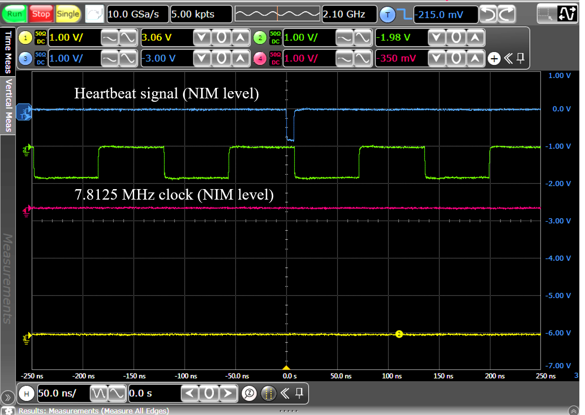

# Practical usage

## Known issues

**複数のプログラムからRBCP通信で同一ボードにアクセスするとパケットの混線が発生する事が確認されています。**
SiTCPは複数のプログラムから独立にRBCP通信を行う事を想定していません。ほぼ同時にSiTCPが複数のRBCPパケットを受け取ると混線します。
スケーラーを常に読み出しているときに、別プロセスから何かレジスタアクセスをしようとすると発生しやすいです。
スケーラー読み出しを一時的に止めるのが理想ですが、止めたくない場合割り込みを受け付けるスケーラーリードプログラムを作ると良いかもしれません。

## Cooling

**全く無風状態で使い続けると恐らくFPGAはダメになります。**
空冷を心掛けてください。
貼り付けるタイプのヒートシンクの例です。多少FPGA温度が改善する報告があります。

- [TGH-0200-02](https://www.digikey.ca/en/products/detail/t-global-technology/TGH-0200-02/13682129) (By TRIUMF 小嶋さん)

## Generation of MCS and download it by Vivado

MCSの生成とダウンロードについて[HULのUG](https://hul-official.gitlab.io/hul-ug/practical/main/)を読んでもらうのがよいと思います。
AMANEQで採用しているSPIフラッシュメモリはS25FL128Sです。HULとはメモリ容量が異なります。
`s25fl128sxxxxxx0-spi-x1_x2_x4`を選択してください。
**また、MCSを生成するときにinterfaceでSPIx4を選択する事を忘れないでください。**

## Difference of SiTCP and SiTCP-XG

SiTCPとSiTCP-XGは異なったライセンスを必要とします。
ファームウェアを入れ替えただけではライセンスは変更されないので、BBT社のMpcWriterを使って書き直してください。
デフォルトIPが両者で異なる事にも注意です。

SiTCPおよびSiTCP-XGの事については、BBT社が管理しています。まずユーザーガイドを参照し、フォーラムを活用してください。

## Common troubles

考えられるとトラブルについて列挙します。

- pingが通らない
    - DIPスイッチの設定を変えてDefault IPで起動してみる。それでもダメならPC側を疑ってみる。
- MIKUMARIで同期できない
    - ハードウェアリセットスイッチを押してみる
- 一台だけ時刻同期出来ていないように感じる
    - スタンドアロンモードになっていないか？
- TCP接続をしたが何も (delimiter wordすら)データが返ってこない
    - FPGAに入っているファームウェアは正しいか？
    - ハートビートフレーム状態をONにしたか？
    - MIKUMARI用のファイバーはささっているか？クロック信号は来ているか？
    - セカンダリLACCPはリンクアップしており、時刻同期が完了しているか？
- RUN毎にモジュールリセットをかけたらおかしくなった
    - RUN毎にモジュールリセットをしないでください。一度動くようになったら放置でよいです。

## Recommended setting

- Str-LRTDC
    - Tdc maskを適切に設定する
    - Self recovery modeをONにする
- Str-HRTDC
    - AutoSwitchをONにする
    - Tdc maskを適切に設定する
    - Self recovery modeをONにする

## About data taking

連続読み出しDAQでは入力ヒット信号は全てPCへ送信されます。
そのため、**この検出器はノイジーだがトリガーレートが非常に低いのでデータレートは問題ないはずだ**、は成立しません。
大量のノイズデータを送信しようとして、場合によっては一瞬でデータ破損します。
入力ヒットレートがデータレートを決めてしまうので、トリガー数で制御できていた従来型のDAQから思考の切り替えが必要です。
この点において、開放になっているAMANEQの入力チャンネルも大きなノイズ源です。
開放の入力は状態が未定義のため0/1が頻繁に切り替わり、高い入力レートを作り出してしまいます。
**とにかく、データ収集を始める前において、入力レートが高くないか、を確認する事がとても大事です。**

入力レートの確認にはスケーラーを活用してください。
繰り返しスケーラーを読んで各チャンネルのレートを計算し、ボード全体のレートを算出してください。
この値に64-bitをかけたものが、データリンクにかかる出力データレートです。
これがデータリンクの帯域の8割程度に収まっていないと、確実にデータ破損します。

検出器のノイズ落としをまず優先して行ってください。
開放チャンネルがある場合、TDCマスクを正しく設定してください。
また、ホットチャンネルがある場合もTDCマスクが有効です。
どうしても入力レートが落ちない場合、heartbeat frame throttlingを有効にして、出力データレートを下げてください。

そうはいっても、とりあえずデータを取ってみたいという事があると思います。
そういう時はトリガーエミュレーションモードを有効にしてトリガー信号を入れてください。
出力データレートの制御に対して、トリガー型DAQと同じ思想が適用できます。
Heartbeat frame throttlingと組み合わせるのも有効でしょう。

Streaming TDCのself recovery modeはONにしておくのがおすすめです。
Local heartbeat frame mismatchが起きた場合、そのFEEから返ってくるデータは最早全く正しくないです。
DAQソフトウェアがデリミターフラグを見て適切に対処するように作られていれば良いですが、多くの場合でそのようにはなっていないと思います。
Self recoveryが働けば、DAQを止めずにFEEが復帰してくれます。これを良しとするかどうかはユーザーの判断にゆだねますが。

## NIM output signals

2025年5月に行ったファームウェアの更新によって、NIM outputからシステムクロック (125 MHz)を16分周した7.8125 MHzのクロック信号が出力できるようになりました。
IO managerによって選択可能な信号については、各ファームウェアの記述を参照してください。
この信号を```clk_div16```とします。
```clk_div16```は外部システムと同期を取るために使うことを想定しており、heartbeat signalとは[図](#CLKDIV16)の位相関係にあります。
NIM outputからこれらの信号を出力し、外部システムのスケーラやTDCで測定することで、異なった時刻ドメインを持つシステムの接続することが出来るようになるでしょう。

{: #CLKDIV16 width="70%"}

## ジー・エヌ・ディーへの問い合わせ

ジー・エヌ・ディーへモジュールの修理を依頼する場合、「このICが破損しているから交換して欲しい」など、具体的な指示を出してください。
ジー・エヌ・ディーはボード設計と製造管理が業務なので、ファームウェアやどうやってAMANEQが動いているかは知らないためです。
なんかおかしいから直してほしいと言っても直してくれません。

トラブルに遭遇したらまず自分たちで調べ、必要であれば回路図などを参照して何が悪いか突き止めてください。
